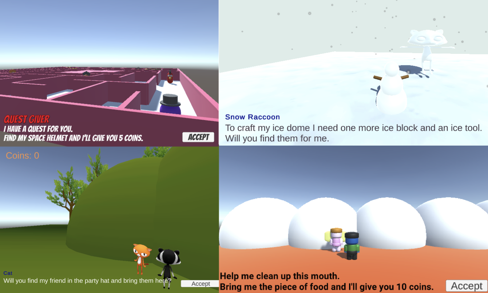

## Introduction

In this project, you will add NPCs and quests to the world that you created in the [World Builder](https://projects.raspberrypi.org/en/projects/world-builder){:target='_blank'} project. 

A **quest** is a task or mission in a computer game that the player can complete to gain a reward or move the story forward. Quests can require a player to fetch or deliver an item, gather items, escort a character to a location, find out information or solve a puzzle. On completion a player could be rewarded with experience, coins, access to new areas or new abilities.

You will:
+ Add an NPC with dialogue that changes based on game state
+ Manage the state of a quest using one or more variables
+ Give behaviour to Player and NPCs to complete one or more quests (gather, escort, deliver).

--- no-print ---

--- task ---

  

### Try it 

Play the quests in the example project. Think about the type of quest and the outcome.  
+ What is the reward for completing the quest? 
+ How do the NPCs interact with the player?
+ How are items used in the quest? 

[Snow Quest](https://raspberrypilearning.github.io/unity-webgl/SnowQuest){:target='_blank'}

<iframe allowtransparency="true" width="710" height="450" src="https://raspberrypilearning.github.io/unity-webgl/SnowQuest" frameborder="0"></iframe>

{:width="400px"}

--- /task ---

### Get inspiration 

You are going to make some design decisions to create your quests.

--- task ---

Explore these example projects to get more ideas:

[Maze Quest](https://raspberrypilearning.github.io/unity-webgl/maze-quest-seeker){:target='_blank'}
{:width="400px"}

[Hill Quest](https://raspberrypilearning.github.io/unity-webgl/HillQuest){:target='_blank'}
{:width="400px"}

--- /task ---

--- /no-print ---

--- print-only ---

### Get inspiration 

You are going to make some design decisions to create your quests.

Use these example images to get more ideas:

Snow quest: https://raspberrypilearning.github.io/unity-webgl/SnowQuest
{:width="400px"}

Maze quest: https://raspberrypilearning.github.io/unity-webgl/maze-quest-seeker
{:width="400px"}

Hill Quest: https://raspberrypilearning.github.io/unity-webgl/HillQuest
{:width="400px"}

--- /print-only ---

