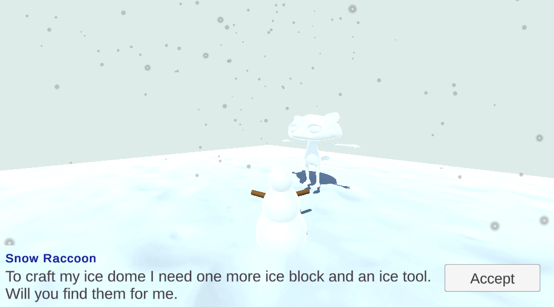
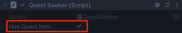

## First quest

The first quest will be a **fetch quest** where a non-player character (NPC) asks the player to find an item and bring it back to them. 

When the Player returns to the Quest Giver, they will be rewarded with experience points (XP) or a reward in the currency of your game.

{:width="300px"}

--- task ---

This project builds on the project you made in the [World builder](https://projects.raspberrypi.org/en/projects/world-builder){:target='_blank'} project. 

Open your project to use as the world, or map, where quests will take place. 

--- /task ---

A **Game Designer** creates the characters, rules, goals, game mechanics, and puzzles that make a game enjoyable and engaging for the player. Some Game Designers do all the coding for their game and others work in teams.

--- task ---

**Design:** Think of a quest that makes sense in the world you have built. 

You will need to decide on:
+ An item to be fetched
+ A non-player character (NPC) to give the quest to the player
+ The messages for the NPC to display before and after the quest is completed
+ A reward of experience points or currency (coins or gems) in your game

--- /task ---

--- task ---

Add a GameObject for the item that the Player will need to fetch. 

Position the item in your world so the Player will need to move from their starting position to find it. 

**Choose:**

[[[unity-item-model]]]

[[[unity-item-3d-shapes]]]

--- /task ---

--- task ---

Add a NPC to be a Quest Giver and position it so that it will be easy for the player to find them.

**Choose:**

[[[unity-npc-model]]]

[[[unity-npc-3d-shapes]]]

--- /task ---

--- task ---
If you choose the Cat, Rat, or Raccoon, then you can set the **Animator Controller** to the **IdleWalk** animation. 

--- /task ---

--- task ---

Add a **Box Collider** to the **Quest Giver** so that the Player can't walk through them.

--- /task ---

The Quest Giver will offer the Player a quest when they get close enough.

--- task ---
Check that your Player GameObject has the Player tag.
--- /task ---

--- task ---

Add a UI **TextMeshPro** named `Quest Text` as a **child of the Quest Giver** and add your quest message to it. 

--- collapse ---

---
title: Add and position TextMeshPro text
---

Change the message text, settings, and position of the text object until you are happy:

You can add another UI **TextMeshPro** to the same canvas with the name of the Quest Giver NPC if you like. 

--- /collapse ---

[[[unity-ui-positioning-2d]]]

--- /task ---

--- task ---

Add a **Box Collider** with a **Trigger** and a **QuestGiver** script on the Quest Giver NPC to make the quest message appear when the Player is nearby. 

{:width="400px"}

--- collapse ---

---
title: Make a message appear when the Player is close enough
---

Add another **Box Collider** with the Trigger property checked. This Box Collider needs to be bigger than the first Box Collider so that the Player can trigger the Quest Giver to display a text box.

Add a script called **QuestGiver** to the **QuestGiver GameObject**. Add `OnTriggerEnter` and `OnTriggerExit` methods to show and hide the message canvas when the Player gets close and moves away. 

Add code to a script on the NPC GameObject. 

--- code ---
---
language: csharp
filename: QuestGiver.cs
line_numbers: false
line_number_start: 5
line_highlights: 7-23, 27
---

public class QuestGiver : MonoBehaviour
{
    public GameObject canvas;

    void OnTriggerEnter(Collider other)
    {
        if (other.CompareTag("Player"))
        {
            canvas.SetActive(true);
        }
    }

    void OnTriggerExit(Collider other)
    {
        if (other.CompareTag("Player"))
        {
            canvas.SetActive(false);
        }
    }
    // Start is called before the first frame update
    void Start()
    {
        canvas.SetActive(false);
    }
}
--- /code ---

Select the **QuestGiver GameObject**. In the Inspector, find the **QuestGiver** script component and drag the **Canvas** for the NPC to the Canvas property of the script.

--- /collapse ---

--- /task ---

--- task ---

**Test:** Play your scene:
+ Check that the Player can't walk through the Quest Giver
+ Make sure the quest message appears when the Player is near the Quest Giver 

**Debug:**

[[[unity-collider-error]]]

[[[unity-trigger-error]]]

--- /task ---

For this quest, the item to be collected should only appear once the quest has been accepted. 

--- task ---

Add an **Accept Button** to the Canvas on your Quest Giver NPC and connect it to a `QuestAccepted` method on your **QuestGiver** script. Update the **QuestGiver** script so the item only appears when the quest has been accepted.

{:width="400px"}

--- collapse ---

---
title: Make an Item GameObject appear when a button is clicked
---

Add a UI **TextMesh Pro Button** to the same canvas and click on the **Text (TMP)** child object of the Button then give it the text `Accept`: 

Adjust the Button and text size, position, and colours until you are happy with them:

Add code to the QuestGiver script to control when the object appears so that it only appears when then quest has been accepted. 

--- code ---
---
language: csharp
filename: QuestGiver.cs
line_numbers: false
line_number_start: 6
line_highlights: 9, 10, 30, 39
---
public class QuestGiver : MonoBehaviour
{
    public GameObject canvas;
    public GameObject button;
    public GameObject item;

    void OnTriggerEnter(Collider other)
    {
        if (other.CompareTag("Player"))
        {
            canvas.SetActive(true);
        }
    }

    void OnTriggerExit(Collider other)
    {
        if (other.CompareTag("Player"))
        {
            canvas.SetActive(false);
        }
    }

    public void QuestAccepted()
    {
        item.SetActive(true); // Make the quest item appear
        canvas.SetActive(false); // Hide the message when the quest has been accepted
        button.SetActive(false); // Don't show the button after the quest has been accepted
    }

    // Start is called before the first frame update
    void Start()
    {
        canvas.SetActive(false);
        item.SetActive(false);
    }
--- /code ---

Select the **Quest Giver**, then in the **QuestGiver** script component in the Inspector window, drag your **Button** and **Item GameObjects** to the Button and Item properties:

From the Hierarchy window, select the **Button GameObject** then go to the Inspector window `OnClick()` property and click on the **+**.

Click on the circle for the field underneath 'Runtime', click on **Scene** and choose your **Quest Giver**. In the Function drop-down menu, select **QuestGiver.QuestAccepted** to join your new method to the Button’s click event:

--- /collapse ---

**Tip:** If you have a Canvas as a child object then you won't be able to focus on the parent GameObject in the Scene view. To fix this, you can disable the Canvas in the Inspector, by unchecking the box next to the name. If you need to see the Canvas again to edit it, you can check the box. 

--- /task ---

--- task ---

**Test:** Play your scene:
+ Check that your item does not appear at the start 
+ Go and talk to the Quest Giver and accept the quest 
+ Make sure that the item appears when the quest is accepted 
+ Also check that the 'Accept' button disappears and isn't shown again if you return to the Quest Giver 

**Debug:**

--- collapse ---

---
title: Nothing happens when I click the Accept button
---

Select your **Quest Giver NPC** and make sure they have a script that has an `QuestAccepted` method.

Check that all the variables are set on the script in the Inspector. 

Click on the **Button** object and check that you have attached the correct method such as `QuestAccepted` to an `OnClick` event. 

Add a `Debug.Log("Quest accepted");` line to the method and check the console to see that the method is being called.

If you are sure the method is being called, check that the code in the method is correct. 

If the method is not being called (no Debug output), then make sure you have an `EventSystem` GameObject in your project. If you accidentally delete this, then button-clicks won't be handled. If it's missing, right-click in the Hierarch window and choose **UI** then **Event System**.

--- /collapse ---

--- /task ---

When the Player collects the item, the item needs to disappear and optionally play a sound effect. The Quest Giver will also need to know when the quest has been completed. 

--- task ---

Add a UI **TextMeshPro** to the scene to display the reward. Add a **QuestSeeker** script to the Player to store and update the reward. 

--- collapse ---

---
title: Add a QuestSeeker script to the Player to manage the reward
---

Right-click in the Hierarchy window and add a UI **TextMeshPro** to your scene to show the reward. Name the new object `Coin Text`, or a suitable name for your reward. 

Add a new **QuestSeeker** script component to the Player to store and display the reward. 

The `coins` variable needs to be `public` so that a script on the Quest Item can update it. 

--- code ---
---
language: csharp
filename: QuestSeeker.cs
line_numbers: false
line_number_start: 4
line_highlights: 4, 8, 9, 20
---
using TMPro;

public class QuestSeeker : MonoBehaviour
{
    public int coins = 0; // Or the reward for your quest
    public TMP_Text coinText;

    // Start is called before the first frame update
    void Start()
    {
        
    }

    // Update is called once per frame
    void Update()
    {
       coinText.SetText("Coins: " + coins); 
    }
}
--- /code ---

--- /collapse ---

With the Player object selected, drag the **Coin Text TextMeshPro** object to the Coin Text property in the Inspector.

--- /task ---

--- task ---

Add a `public bool hasQuestItem = false;` variable to the **QuestSeeker** script. The variable needs to be `public` so that a script on the item sets it to `true` when the item is collected.

--- collapse ---

---
title: Add a hasQuestItem variable to the QuestSeeker script
---

--- code ---
---
language: csharp
filename: QuestSeeker.cs
line_numbers: false
line_number_start: 4
line_highlights: 8
---
using TMPro;

public class QuestSeeker : MonoBehaviour
{
    public bool hasQuestItem = false; 
    public int coins = 0; 
    public TMP_Text coinText;

    // Update is called once per frame
    void Update()
    {
       coinText.SetText("Coins: " + coins); 
    }
}
--- /code ---

--- /collapse ---

--- /task ---

--- task ---

Add a **Box Collider** with a **Trigger** and **QuestItemController** script to your Quest Item. Add code to hide the Quest Item and set `hasQuestItem` to true on the Player's QuestSeeker script when the Player collides with the Quest Item.

{:width="400px"}

--- collapse ---

---
title: Make the item disappear and set hasQuestItem to true
---

Select the **Quest Item** and add a **Box Collider** with a **Trigger**. 

Add a **script** to the **Quest Item** and name it `QuestItemController`.

Add code to make the item hide and update the `hasQuestItem` status on the Player. 

--- code ---
---
language: csharp
filename: QuestItemController.cs
line_numbers: false
line_number_start: 5
line_highlights: 9-16
---
public class QuestItemController : MonoBehaviour
{
    public QuestSeeker player;

    private void OnTriggerEnter(Collider other)
    {
        if (other.CompareTag("Player"))
        {
            player.hasQuestItem = true;
            gameObject.SetActive(false);
        }
    }
--- /code ---

Drag the **Player GameObject** to the Player property of the QuestItemController script in the Inspector for the Quest Item.

--- /collapse ---

Optionally, also play a sound when the item is collected. 

[[[unity-play-sound]]]

--- /task ---

--- task ---

**Test:** Play your scene:
+ Talk to the Quest Giver NPC and accept the quest 
+ Check that you can collect the Quest Item 
+ While you are still in Play mode, click on the Player and check that the `hasQuestItem` property in the Inspector window is checked to show that the quest item has been collected 

--- collapse ---

---
title: My Quest Item doesn't disappear
---

Check that the Quest Item has a script with an `OnTriggerEnter` method that deactivates the Quest Item when the Player collides with it. 

Make sure you have added a Box Collider with a Trigger and that the collider is bigger than any non-trigger colliders so that the Player is able to trigger it. 

Check that the Player GameObject has the Player tag.

--- /collapse ---

--- /task ---

--- task ---

Have the Quest Giver NPC display a different message if the quest is complete and give the player a reward for completing the quest.

{:width="400px"}

--- collapse ---

---
title: Update the QuestGiver script to thank and reward the player
---
--- code ---
---
language: csharp
filename: QuestGiver.cs
line_numbers: false
line_number_start: 1
line_highlights: 4, 11, 12, 18-23
---
using System.Collections;
using System.Collections.Generic;
using UnityEngine;
using TMPro;

public class QuestGiver : MonoBehaviour
{
    public GameObject canvas;
    public GameObject button;
    public GameObject item;
    public TMP_Text message;
    public QuestSeeker player;

    void OnTriggerEnter(Collider other)
    {
        if (other.CompareTag("Player"))
        {
            if (player.hasQuestItem)
            {
                message.SetText("Thank you for finding my fishbone. Here's 10 coins for your efforts!");
                player.coins += 10;
                player.hasQuestItem = false;
            }    
            canvas.SetActive(true);
        }
    }
--- /code ---

In the Inspector, drag the **Player** to the Player property and the **TextMeshPro** object with the message to the Message property.

--- /collapse ---

--- /task ---

--- task ---

**Test:** Play your scene:
+ Make sure you get a different message after collecting the Quest Item 
+ Check that the number of coins also increases
+ Make sure the player can't get the reward more than once

--- /task ---

--- task ---

**Debug:** You might find some bugs in your project that you need to fix. Here are some common bugs.

[[[unity-console-error]]]

[[[unity-changes-gone]]]

[[[unity-method-absent]]]

[[[unity-show-variables]]]

--- collapse ---

---
title: I can't drag a GameObject into my variable in the Inspector
---

Look through the steps above and make sure that you have added all the scripts to the correct GameObjects. 

Check that the variable is `public`.

--- /collapse ---

--- /task ---

--- save ---
