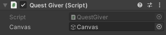
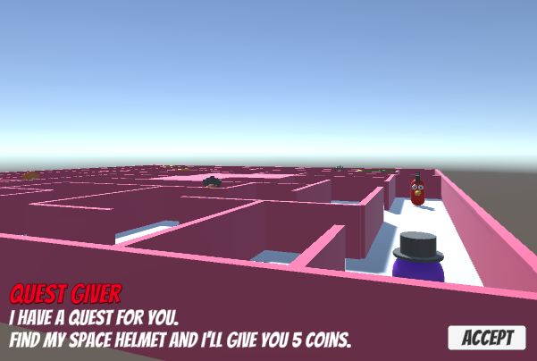

## First quest

<div style="display: flex; flex-wrap: wrap">
<div style="flex-basis: 200px; flex-grow: 1; margin-right: 15px;">
The first quest will be a **fetch quest** where an NPC asks the player to find an item and bring it back to them. When the player returns to the quest giver they will be rewarded with experience points (XP) or a reward in the currency of your game.
<div>
Image, gif or video showing what they will achieve by the end of the step. {:width="300px"}
</div>
</div>

--- task ---

This project builds on the project you made in the [World Builder](https://projects.raspberrypi.org/en/projects/world-builder) project. 

Open your project to use as the world, or map, where quests will take place. 

--- /task ---

--- task ---
Think of a quest that makes sense in the world you have built. 

You will need to choose:
+ An item to be fetched,
+ A non-player character,
+ A reward of experience points or currency (coins or gems) in your game.

--- /task ---

--- task ---

Add a GameObject for the item that the player will need to fetch. Position the item in your world so the player will need to move from their starting position to find it. 

**Choose:**

--- collapse ---

---
title: Create an item from a model
---

Navigate to the Model you want to use in the Project window. 

Drag the model to your scene and position it: 


--- /collapse ---

--- collapse ---

---
title: Create an item from 3D shapes
---

Add a '3D Object' to your scene to represent the item and give the new GameObject a sensible name.  

Right-click your new 3D shape and add other 3D shapes from 'Create' -> '3D Object' as child game objects. The child objects will move with the first 3D shape GameObject. 

Bring your shapes to life by dragging Materials from the Project window to the shape in the Scene view. 

This helmet has a sphere with child GameObjects that are spheres, a capsule and a cylinder. The shapes have been renamed to the part of the helmet they represent and coloured with Materials. 


--- /collapse ---

--- collapse ---

---
title: Tag your item
---

**Create a new tag.** Go to the ‘Tag’ property at the top of the Inspector window and ‘Add Tag’. Click on the ‘+’ and call the new tag ‘Item’. GameObjects with an ‘Item’ tag will be things to be fetched as part of this quest.

**Apply your new tag.** Click on your GameObject in the Hierarchy window and use the Tag dropdown box to select ‘Item’ from the list.

--- /collapse ---

--- /task ---

--- task ---

Add a non-player character to be a Quest Giver. 

You could:
+ use one of the animal characters 


+ create your own character from 3D objects. 


Position your NPC so that it will be easy for the player to find them.

Customise your character by dragging 'Materials' onto the GameObjects in the Scene view. This example uses the Cat model with a white 'Snow' material instead of its usual material:


--- /task ---

--- task ---

Add a Box Collider to the Quest Giver so that the player can't walk through them.


--- /task ---

The Quest Giver will offer the player a quest when they get close enough.

--- task ---

Add a UI TextMeshPro to the Quest Giver to contain the message offering the quest: 


Name the GameObject to match the NPC that it belongs to, for example 'Snow Cat Quest'. 

Change the settings and position of the text object until you are happy with the look:


You can add another UI TextMeshPro to the same canvas with the name of the Quest Giver NPC if you like: 


--- /task ---

--- task ---
Use a Box Collider with a Trigger to make the quest message appear when the Player is nearby. 

--- collapse ---

---
title: Make a text message appear when the player is close enough
---

Add another Box Collider with the Trigger property checked. This Box Collider needs to be bigger than the first Box Collider so that the player can trigger the Quest Giver to display a text box.


Add a script called 'QuestGiver' to the QuestGiver GameObject. Add `OnTriggerEnter` and `OnTriggerExit` methods to show and hide the message canvas when the Player gets close and moves away. 

```
public class QuestGiver : MonoBehaviour
{
    public GameObject canvas;
    public GameObject button;

    // Start is called before the first frame update
    void Start()
    {
        canvas.SetActive(false);
        item.SetActive(false);
    }

    void OnTriggerEnter(Collider other)
    {
        if (other.gameObject.tag == "Player")
        {
            canvas.SetActive(true);
        }
    }

    void OnTriggerExit(Collider other)
    {
        if (other.gameObject.tag == "Player")
        {
            canvas.SetActive(false);
        }
    }

    public void QuestAccepted()
    {
        canvas.SetActive(false);
        button.SetActive(false); // Don't show the Accept button again
    }
}
```

Select the QuestGiver GameObject. In the Inspector, find the QuestGiver script component and drag the Canvas for the NPC to the Canvas property of the script, and the Button to the Button property. 



<mark>Or we could use GetComponent?</mark>

--- /collapse ---

--- /task ---

--- task ---

For this quest, the item to be collected should only appear once the quest has been accepted. 

--- collapse ---

---
title: Make a GameObject appear when a button is clicked
---

Add a UI TextMesh Pro Button to the same canvas and click on the Text (TMP) child object of the Button then give it the text 'Accept': 


Adjust the Button & Text size, position and colours until you are happy with them:



Add code to the QuestGiver script to control when the object appears so that it only appears when then quest has been accepted.  

```
public class QuestGiver : MonoBehaviour
{
    public GameObject canvas;
    public GameObject button;
    public GameObject item;

    // Start is called before the first frame update
    void Start()
    {
        canvas.SetActive(false);
        item.SetActive(false);
    }

    void OnTriggerEnter(Collider other)
    {
        if (other.gameObject.tag == "Player")
        {
            canvas.SetActive(true);
        }
    }

    void OnTriggerExit(Collider other)
    {
        if (other.gameObject.tag == "Player")
        {
            canvas.SetActive(false);
        }
    }

    public void QuestAccepted()
    {
        item.SetActive(true);
        canvas.SetActive(false);
        button.SetActive(false);
    }
}
```

Select the QuestGiver then in the QuestGiver script component in the Inspector window, drag your item GameObject to the 'Item' property:


From the Hierarchy window, select the Button GameObject then go to the Inspector window ‘On Click ()’ property and click on the ‘+’.

Click on the circle for the field underneath ‘Runtime’, click on ‘Scene’ and choose your QuestGiver. In the ‘Function’ dropdown select ‘QuestGiver.QuestAccepted’ to join your new method to the Button’s click event:


--- /collapse ---

**Tip:** When you have a Canvas as a child object you will need to disable it in the Inspector, by unchecking the box next to the name, so you can focus on the GameObject using 'F' or 'Shift-F'. If you need to see it again to edit it you can check the box. 


--- /task ---

--- task ---
**Test:** Check that your item does not appear when you Play your scene. Go and talk to the QuestGiver and Accept the quest. Make sure that the item appears. 

--- /task ---

When the player collects the item the item needs to disappear and optionally play a sound effect. The Quest Giver will also need to be able to find out that the quest has been completed. 

--- task ---

Right-click in the Hierarchy window and go to ‘UI’ then select ‘Text - TextMeshPro’. Name the new Object 'Coins'. 

Add a new 'QuestSeeker' script component to the **Player** to keep track of the quest state including the number of coins.

Add a `bool` variable called `hasQuestItem` to store whether the quest item has been collected. 

Add a `coins` variable to store the reward and a coinText variable to store the TextMeshPro object to display the number of coins. Update the display of the coins in the `Update` method.

```
using TMPro;

public class QuestSeeker : MonoBehaviour
{
    public bool hasQuestItem = false;
    public int coins = 0;
    public TMP_Text coinText;
    
    // Start is called before the first frame update
    void Start()
    {
        
    }

    // Update is called once per frame
    void Update()
    {
       coinText.SetText("Coins: " + coins); 
    }
}

```

Drag the Coins TextMeshPro object to the Coin Text property in the Inspector.

--- /task ---

--- task ---
Select the QuestItem and add a Box Collider with a Trigger. 

Add a script to the QuestItem and name it 'QuestItemController'.

Add code to make the item hide and update the `hasQuestItem` status on the Player. 

```
public class QuestItemController : MonoBehaviour
{
    public QuestSeeker player;

    void OnTriggerEnter(Collider other)
    {
        if (other.gameObject.tag == "Player")
        {
            player.hasQuestItem = true;
            Destroy(gameObject);
        }
    }
}
```

Drag the Player GameObject to the player property of the QuestItemController script in the Inspector for the QuestItem.


Optionally, also play a sound when the item is collected. 

--- /task ---

--- task ---

**Test:** Play the scene. Talk to the QuestGiver NPC and accept the quest. Check that you can collect the QuestItem. While you are still in Playmode, click on the Player and check that the `hasQuestItem` property in the Inspector window is checked to show that the quest item has been collected. 


--- /task ---

--- task ---

Have the QuestGiver NPC display a different message if the quest is complete and give the player a reward for completing the quest.

Add variables to store the Player and the message.

```
public TMP_Text message;
public QuestSeeker player;

void OnTriggerEnter(Collider other)
    {
        if (other.gameObject.tag == "Player")
        {
            if (player.hasQuestItem)
            {
                message.SetText("Thankyou so much for finding me a lucky clover!");
                player.coins+= 10; // give the reward
                player.hasQuestItem = false; // make sure the player can't get the reward again
            }

            canvas.SetActive(true);
        }
    }
 ```

In the Inspector, Drag the player to the Player property and the TextMeshPro object with the message to the Message property.

--- /task ---

--- task ---
**Test:** Play your scene and make sure you get a different message after collecting the QuestItem. Check that the number of coins also increases. Make sure the player can't get the reward more than once.

--- /task ---

--- task ---
You can also display the number of coins the player has on the screen.

Add a UI - TextMeshPro GameObject and call it Coins. Anchor the text to the top-left of the Screen.

--- /task ---

--- task ---

**Debug:** You might find some bugs in your project that you need to fix. Here are some common bugs.

--- collapse ---

---
title: I can't drag a GameObject into the variable in the Inspector
---

Look through the steps above and make sure that you have added all the scripts to the correct GameObjects. 

--- /collapse ---

--- collapse ---

---
title: I can't find the right material to use
---

You can select the materials folder in the Project window to see all the Materials you have created  

--- /collapse ---

--- collapse ---

---
title: I can't drag a GameObject into the variable in the Inspector
---

Look through the steps above and make sure that you have added all the scripts to the correct GameObjects. 

--- /collapse ---

--- /task ---

--- save ---
