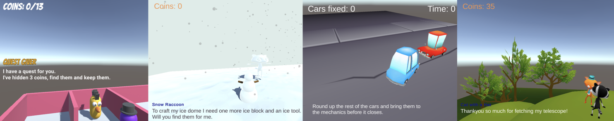
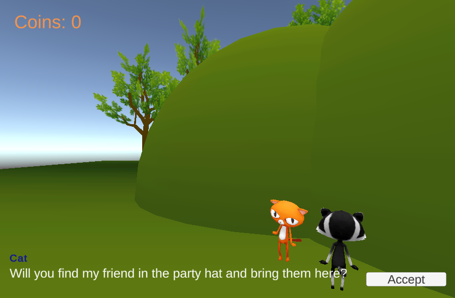
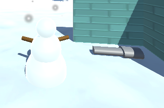
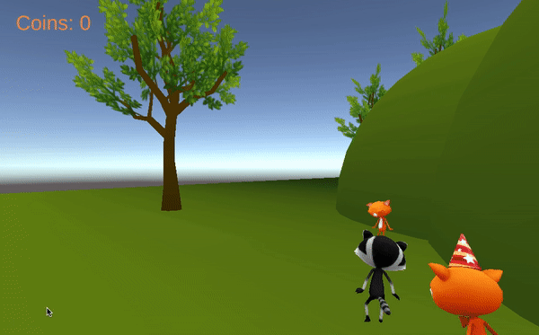
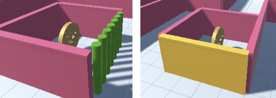

## Second quest

<div style="display: flex; flex-wrap: wrap">
<div style="flex-basis: 200px; flex-grow: 1; margin-right: 15px;">
Add another NPC with a different quests and reward. You can choose from different quest types.  
</div>
<div>
{:width="300px"}
</div>
</div>

<p style="border-left: solid; border-width:10px; border-color: #0faeb0; background-color: aliceblue; padding: 10px;">
If quests are revealed and then completed in a specific sequence this is called <span style="color: #0faeb0">**linear**</span> gameplay or storytelling. If the player can choose the order in which they complete quests then this is <span style="color: #0faeb0">**non-linear**</span> gameplay. Some games mix linear and non-linear gameplay or storytelling. Quests that must be completed are called **main quests** and optional extra quests are called **side quests**. 
</p>

--- task ---

**Plan:** Design your second quest. The quests will be **non-linear** so they can be started in any order. 

You quest could be:
+ A **gather** quest with multiple items of the same kind.
+ A **recipe** or **crafting** quest with multiple items of different kinds. 
+ An **escort** quest where you have to find another NPC and have them follow the player back to the Quest Giver (or to another location)
+ A **deliver** quest where you are given an object to take to another NPC. 



The reward could be:
+ Experience points (XP), reputation, coins, gems or another in-game currency.
+ An accessory for the player. 
+ Unlocking an new area or item in the game. 

Or, a combination of these. 

If you want to prevent the Player accepting the quest before they have completed it, you could:

+ Use `SetActive` to make the quest items appear when the quest is accepted.
+ Use a `questAccepted` variable to ignore the player if the quest has not been accepted. 

--- /task ---

For each quest you will need to:
+ Add a new NPC to be the quest giver with UI objects to communicate about the quest. 
+ Update the QuestSeeker script on the Player with variables to store the state of the new quest. 
+ Add items and other NPCs depending on the quest type. 
+ Add a script to to the quest giver NPC to control the conversation and reward based on the state of the quest.
+ Add scripts to items and other NPCs according to the quest type.

--- task ---

Add a new GameObject to be the second QuestGiver NPC. 

**Choose:**

--- collapse ---

---
title: Duplicate your first NPC and make changes to it
---


Right-click on the QuestGiver GameObject you created for the first quest and select 'Duplicate'. This creates a copy of your QuestGiver GameObject with all the child GameObjects. 

The QuestGiver GameObject will be created in the same position, use the Scene view or Inspector to position it somewhere else. 

Remove the existing 'QuestGiver' script component from the Inspector by clicking on the three dots and selecting 'Remove Component'.

--- /collapse ---

--- collapse ---

---
title: Add a new QuestGiver NPC GameObject
---

Choose a model or create a new QuestGiver NPC GameObject out of 3D shapes.  


Add a Box Collider so that the Player cannot walk through the new QuestGiver NPC and a second Box Collider, that is bigger than the first, with 'Is Trigger' checked. 

Right-click on the Canvas for your first NPC and choose copy. Then, right-click on your new QuestGiver NPC and choose 'Paste as Child'. This will make a copy of the UI objects for your new QuestGiver.

--- /collapse ---

In the Inspector:
+ Edit the text in the Message on your new QuestGiver NPC Canvas to describe your new quest. Change the text style to suit your new character. 
+ Edit the text in the Name object to match your new NPC.


--- collapse ---

---
title: Create a new script for the QuestGiver NPC
---

**QuestGiver2** script:
```
using TMPro;

public class QuestGiver2 : MonoBehaviour
{
    public GameObject canvas;
    public GameObject button;
    public QuestSeeker player;

    // Start is called before the first frame update
    void Start()
    {
        Debug.Log("Quest giver 2 start"); // Update with the name of your quest
        canvas.SetActive(false);
    }

    void OnTriggerEnter(Collider other)
    {
        if (other.CompareTag("Player"))
        {
            canvas.SetActive(true);
        }
    }

    void OnTriggerExit(Collider other)
    {
        if (other.CompareTag("Player"))
        {
            canvas.SetActive(false);
        }
    }

    public void QuestAccepted()
    {
        Debug.Log("Quest 2 accepted"); // Update with the name of your quest

        canvas.SetActive(false);
        button.SetActive(false);
    }
}
```

--- /collapse ---

In the Inspector, making sure you are updating the child objects and components for your new QuestGiver NPC:
+ Drag the Canvas, Message and Button objects to your new Script,
+ Select the Button and add an 'OnClick' set to the `QuestAccepted` Method of your new script.

--- /task ---

--- task ---

**Test:** Play your scene and make sure you see the new quest message and that you can Accept the quest with the button. Check that you can see the debug message in the Console.



--- /task ---

--- task ---

Depending on the type of quest you have chosen, add or create the GameObjects that you will use as collectibles, followers or rewards and position them in your scene. 

Create a tag for the new GameObjects in your new quest, such as 'CakeQuest' and apply the tag to them - you use this tag to show all of the quest items when the quest is accepted.

Add a Box Collider component to your item GameObject and check the 'Is Trigger' Box Collider property.


**Choose:** Add visual effects to your collectibles, followers or rewards.

[[[unity-particle-system]]]

[[[unity-gameobject-spin]]]


You could also add the `IdleWalk` animation or create a new Animator. 

[[[unity-animation]]]

If your quest has multiple items then add the same tag to each of them. 

--- collapse ---

---
title: Tag your items
---

**Create a new tag.** Go to the ‘Tag’ property at the top of the Inspector window and ‘Add Tag’. Click on the ‘+’ and add a tag for your quest, for example 'KeyQuest'. This will allow you to find all the GameObjects with the same tag so you can activate and deactivate them.

**Apply your new tag.** Select the GameObjects that are items in this quest in the Hierarchy window and use the Tag dropdown box to select your new tag from the list.

--- /collapse ---

**Tip:** If all of your collectibles, followers or rewards are to look and act in the same way, make sure you add all your effects before duplicating the first GameObject. 


--- /task ---

--- task ---
If it makes sense for your quest, update the new  QuestGiver NPC script to set up items at the start and show them when the quest begins.

You may need to hide quest items and reward items.

**Choose:**

--- collapse ---

---
title: Hide items with the same tag
---

GameObject[] collectables;

    // Start is called before the first frame update
    void Start()
    {
        canvas.SetActive(false);

        collectables = GameObject.FindGameObjectsWithTag("Collectable");
        foreach (var Collectable in collectables)
        {
            Collectable.SetActive(false);
        }
    }

--- /collapse ---

--- collapse ---

---
title: Hide individual items
---

**QuestGiver2** script

```
    public GameObject iceDome;

    void Start()
    {
        // Don't show the quest message at the start
        canvas.SetActive(false);

        iceDome.SetActive(false);
    }
```

Assign GameObjects to variables in Unity editor.  

--- /collapse ---

--- /task ---

--- task ---
Update the **QuestSeeker** script used by the player with variables to keep track of the status of the quest such as items collected, items delivered or NPC following. 


**Choose:**

--- collapse ---

---
title: Add variables for multiple different items in a craft or recipe quest
---

In a recipe or craft quest, the player will need to collect multiple items of different kinds to make a recipe or craft a new item. 


**QuestSeeker** script:
```
// Add a variable for each item to be collected
public bool hasIceBlock = false;
public bool hasIceTool = false;
```

--- /collapse ---

--- /task ---

--- task ---
Add a script to each quest item or other NPC involved in the quest so that they react when the player collides with them:

--- collapse ---

title: Collect recipe or crafting quest items
---

Here's an example for an IceTool, the same project also has a IceBlock collectible GameObject with a similar script. 



```
public class IceToolController : MonoBehaviour
{
    public QuestSeeker player;

    void OnTriggerEnter(Collider other)
    {
        if (other.CompareTag("Player"))
        {
            player.hasIceTool = true;
            gameObject.SetActive(false);
        }
    }
}

```

--- /collapse ---

--- /task ---

--- task ---
Add a `QuestAccepted` method to your new Quest Giver NPC to set up the quest when it has been accepted. Connect the method to the 'Accept' button for the quest. 

--- collapse ---

---
title: Make an individual item appear
---

**QuestAccepted** method of **QuestGiver2** script:

```
        key.SetActive(true);
```

--- /collapse ---

--- collapse ---

---
title: Make multiple items with the same tag appear
---

**QuestAccepted** method of **QuestGiver2** script:
```
    foreach (var Collectable in collectables)
    {
        Collectable.SetActive(true);
    }

```

--- /collapse ---

--- /task ---

--- task ---
The Quest Giver NPC needs to check for completion of the quest and give the player a reward, but only once.

--- collapse ---

---
title: Check condition
---

```

// And && condition to check whether 
            if (player.hasIceBlock && player.hasIceTool)
            {
                // Change to a successful completion message
                message.SetText("Thankyou for helping me finish my ice dome. You can climb it if you like.");

                // Reward and story actions
                iceDome.SetActive(true);

                // Make sure the reward can't be given again
                player.hasIceBlock = false;
                player.hasIceTool = false;
            }

```

--- /collapse ---

--- /task ---

--- task ---
The QuestGiver should also give the player a reward.

--- /task ---

--- task ---

--- collapse ---

---
title: Recipe or craft quest
---

Add a script to each collectible item, so that it disappears and updates the QuestSeeker 
You will need to drag the Player GameObject in the inspector. 


Update the new  QuestGiver NPC script to show and hide quest items:

```
using TMPro;

public class QuestGiver2 : MonoBehaviour
{
    public GameObject canvas;
    public GameObject button;
    public GameObject iceBlock;
    public GameObject iceTool;
    public GameObject iceDome;
    public TMP_Text message;
    public QuestSeeker player;

    void Start()
    {
        // Don't show the quest message at the start
        canvas.SetActive(false);

        // Hide the quest items and reward or result objects
        iceBlock.SetActive(false);
        iceTool.SetActive(false);
        iceDome.SetActive(false);
    }

    void OnTriggerEnter(Collider other)
    {
        if (other.gameObject.tag == "Player")
        {
            // And && condition to check whether 
            if (player.hasIceBlock && player.hasIceTool)
            {
                // Change to a successful completion message
                message.SetText("Thankyou for helping me finish my ice dome. You can climb it if you like.");

                // Reward and story actions
                iceDome.SetActive(true);
                player.coins+= 20;

                // Make sure the reward can't be given again
                player.hasIceBlock = false;
                player.hasIceTool = false;
            }

            canvas.SetActive(true);
        }
    }

    void OnTriggerExit(Collider other)
    {
        if (other.gameObject.tag == "Player")
        {
            // Hide the message
            canvas.SetActive(false);
        }
    }

    
}

```

--- /collapse ---

--- collapse ---

---
title: Gather quest
---

In a 'Gather quest' the player will collect multiple items of the same type. 

Update your 'QuestSeeker' script to keep track of the number of collectables:

```
public int collectables = 0;
```

Add code to your collectables controller script to destroy the collectable item GameObject and add one to the 'collectables' variable. 

You might also want to:
+ add to the total you displayed in quest 1 
+ add a sound effect  

```
public QuestSeeker player;
public AudioClip collectSound;

void OnTriggerEnter(Collider other)
    {
    // Check the tag of the colliding object
        if (other.gameObject.tag == "Player")
        {
            Destroy(gameObject);
            player.collectables += 1;
            player.coins += 1; // overall score
            AudioSource.PlayClipAtPoint(collectSound, transform.position);

        }
    }
```

Drag the Player GameObject into the 'Player' property of the Collectable's controller script the Inspector window. 

Add code to your Quest Giver NPC script create a new variable to store the  GameObjects that have a collectable/item tag and set their states at different points in the quest. Complete your OnTriggerEnter method to change the message only when all the items have been collected:

```
using TMPro;

public class QuestGiverNPC : MonoBehaviour
{
    public GameObject canvas;
    public TMP_Text message;
    public GameObject button;
    public QuestSeeker player;
    GameObject[] collectables;

    // Start is called before the first frame update
    void Start()
    {
        canvas.SetActive(false);

        collectables = GameObject.FindGameObjectsWithTag("Collectable");
        foreach (var Collectable in collectables)
        {
            Collectable.SetActive(false);
        }
    }

    private void Update()
    {

    }

    public void CoinsAccepted()
    {
        foreach (var Collectable in collectables)
        {
            Collectable.SetActive(true);
        }

        canvas.SetActive(false);
        button.SetActive(false); // Don't show the Accept button again
    }

    void OnTriggerEnter(Collider other)
    {
        if (other.gameObject.tag == "Player")
        {
            canvas.SetActive(true);

            if (player.coins > 2) // if all the coins have been collected
            {
                message.SetText("Well done you collected the coins!");
              
            }

        }
    }

    void OnTriggerExit(Collider other)
    {
        if (other.gameObject.tag == "Player")
        {
            canvas.SetActive(false);
        }
    }
```

--- /collapse ---

--- collapse ---

---
title: Deliver quest
---

Quest giver gives you an object to deliver to another NPC. Get a reward when you return.

--- /collapse ---

--- collapse ---

---
title: Escort quest
---

Make sure you have a QuestGiver NPC and a Follower NPC. 

Update the **QuestSeeker** script used by the player with variables to keep track of the quest:

```
    // The follower should only follow if the quest has been accepted
    public bool followQuestAccepted = false;

    // Set to true when the follower is following the player
    public bool friendFollower = false;
```

Add a script to the Follower NPC to get them to follow the player if the quest has been accepted but not completed. 

You will need to add a Box Collider with a Trigger. Make this bigger than other colliders on the NPC so that the following behaviour can be triggered but the player can't walk through or over the follower. 

If your follower NPC uses the 'IdleWalk' animator then you should also update the `isMoving` parameter to control the animation used.

```
public class FriendFollower : MonoBehaviour
{
    public QuestSeeker Player; 
    public float followSpeed = 3f;
    public float followDistance = 1.6f;
    Animator anim;

    // Start is called before the first frame update
    void Start()
    {
        anim = gameObject.GetComponent<Animator>();
        anim.SetBool("isMoving", false);
    }

    // Update is called once per frame
    void Update()
    {
        transform.LookAt(Player.transform);

        if(Player.friendFollower == true && Vector3.Distance(Player.transform.position, transform.position) > followDistance)
        {
                anim.SetBool("isMoving", true);
                CharacterController controller = GetComponent<CharacterController>();                
                var moveDirection = Vector3.Normalize(Player.transform.position - transform.position);
                controller.SimpleMove(moveDirection * followSpeed);           
        }
        else
        {
            anim.SetBool("isMoving", false);
        }       
    }

    void OnTriggerEnter(Collider other)
    {
        if (other.gameObject.tag == "Player" && Player.followQuestAccepted)
        {
            Player.hasFollower = true;
        }
    }
}

```

You will need to add a Box Collider (without a Trigger) around the Follower to make sure that the player can't climb on top of them!

Update the script you added to your QuestGiver NPC to set up the quest and give rewards. 

```
using TMPro;

public class EscortQuestGiver : MonoBehaviour
{
    public GameObject canvas;
    public GameObject button;
    public TMP_Text message;
    public HillQuestSeeker player;

    void Start()
    {
        Debug.Log("Escort quest start");
        // Don't show the quest message at the start
        canvas.SetActive(false);
    }

    void OnTriggerEnter(Collider other)
    {
        if (other.gameObject.tag == "Player")
        {
            if (player.friendFollower)
            {
                // Change to a successful completion message
                message.SetText("Thankyou finding my friend.");

                // Reward and story actions
                player.coins+= 20;
                player.friendFollower = false;
                player.followQuestAccepted = false;
            }

            canvas.SetActive(true);
        }
    }

    void OnTriggerExit(Collider other)
    {
        if (other.gameObject.tag == "Player")
        {
            // Hide the message
            canvas.SetActive(false);
        }
    }

    public void QuestAccepted()
    {
        Debug.Log("Escort quest accepted");

        // Follower will now follow if player gets close
        player.followQuestAccepted = true;

        button.SetActive(false);  
        canvas.SetActive(false);     
    }
}
```

--- /collapse ---

--- /task ---

--- task ---

**Choose:** What happens when your Player gets a collectible, follower or reward? This will depend upon which type of quest you are creating:

--- collapse ---

---
title: Currency or experience
---

Instead of using coins you could use a different currency for your game. Or you could reward the player with XP (experience points).

Keep track of currency or points rewards using a variable on the QuestSeeker script and have the QuestGiver scripts update it when a quest is completed. 


```
public int gems; // Keep track of gems. 
``` 

```
player.gems += 2; // Give a reward to the player
```


--- /collapse ---

--- collapse ---

---
title: An accessory or follower
---

You could use `SetActive` to enable a child item to show an accessory such as a hat. You will need to create a public variable on the Quest Giver NPC to store the child item and drag it in the Inspector.

```
public GameObject hat;
```

Then use `SetActive` when the quest has been completed. 

```
hat.SetActive(true)
```

You could also make an NPC character become a follower or a pet by changing the variable that they check to decide whether to follow the player. 

```
player.dogFollowing = true;
```



--- /collapse ---

--- collapse ---

---
title: Unlock
---

A type of reward could be to remove a barrier or get access to an area or items that were not available previously.



Think about the GameOjbects you want to remove. Create and apply a new 'Unlock' tag to them.

Open your QuestGiver script and create  variable to store the Unlock GameObjects:

```
    public GameObject[] unlock;

```

Add code to the Start() method to turn the items on at the start.

        unlock = GameObject.FindGameObjectsWithTag("Unlock");

        foreach (var Unlock in unlock)
        {
            Unlock.SetActive(true);
        }

Create an unlock script and attach it to a new NPC quest ally or to a new unlock item. 

```
public class Unlock : MonoBehaviour
{
    public GameObject canvas;
    public AudioClip collectSound;
    public QuestGiver unlock;

    // Start is called before the first frame update
    void Start()
    {
       
        canvas.SetActive(false);
    }

    // Update is called once per frame
    void Update()
    {

    }

    void OnTriggerEnter(Collider other)
    {
        if (other.gameObject.tag == "Player")
        {
        
            canvas.SetActive(true);
            AudioSource.PlayClipAtPoint(collectSound, transform.position);

            foreach (var Unlock in unlock.unlock)
            {
                Unlock.SetActive(false);
            }
        }
    }

    void OnTriggerExit(Collider other)
    {
        if (other.gameObject.tag == "Player")
        {
            canvas.SetActive(false);
        }
    }
}
```


You could also introduce a a new NPC quest enemy or a new lock item to turn replace the barriers.


--- /collapse ---

--- /task ---


--- task ---
The second Quest Giver NPC needs to check whether the player has completed the quest and give the reward.


--- /task ---

--- task ---

**Debug:** You might find some bugs in your project that you need to fix. 

Always check the Console for errors in your scripts. Unity gives helpful error messages for lots of common problems and you can often click on the error message to go straight to the problem.

--- collapse ---

---
title: My new Quest Giver displays the wrong message
---

Select the Quest Giver and find its script component. Make sure that the correct GameObjects (the ones for this quest which are child objects of the QuestGiver) are used. If you click on an attached GameObject in the Inspector then that object will be highlighted in the Hierarchy. 

Check that you have changed:
+ The quest text in the Message TextMeshPro GameObject.
+ The quest completion text in the `OnTriggerEnter` method that gets set when the quest is completed.

If the QuestGiver isn't showing the quest complete message when you think the quest has been completed then check your code carefully. Are you correctly updating the quest state in the QuestSeeker script and correctly checking it in the QuestGiver script for this Quest Giver?

Add `Debug.Log()` statements and check that values change in the Inspector during Playmode when you expect them to.

--- /collapse ---

--- collapse ---

---
title: Nothing happens when I click the Accept button
---

Select your QuestGiver NPC and make sure they have a script that has an `AcceptQuest` method.

Check that all the variables are set on the script in the Inspector. 

Click on the Button object and check that you have attached the correct Method such as `AcceptQuest` to an 'OnClick' Event. 

Add a `Debug.Log("Quest accepted");` line to the method and check the console to see that the method is being called.

If you are sure the method is being called, check that the code in the method is correct. 

If the method is not being called (no Debug output) then make sure you have an `EventSystem` GameObject in your project. If you accidentally delete this then button-clicks won't be handled. If it's missing, right-click in the Hierarch and choose 'UI' then 'Event System'.

--- /collapse ---

--- collapse ---

---
title: My collectible doesn't disappear
---

Check that the collectible has a script with an `OnTriggerEnter` method that destroys the collectible if the player collides with it. 

Make sure you have added a Box Collider with a Trigger and that the collider is bigger than non-trigger colliders so that the Player is able to trigger it. 

Check that the Player GameObject has the 'Player' tag.

--- /collapse ---

--- collapse ---

---
title: My follower doesn't follow
---

Check that you have added a Character Controller component and a script to control the follower's movement. 

Make sure that the script has access to the Player, if you are using a public variable for the Player then check that you have assigned it in the Inspector. 

Check that the conditions to follow the player are true. Use `Debug.Log()` statements and check variables in the Inspector. 

Make sure that the follower is detecting the collision with the player. Make sure the follower has a Box Collider with a Trigger and that this collider is bigger than other colliders. 

--- /collapse ---

--- collapse ---

---
title: Player or NPCs are walking on top of each other!
---

<mark>Add when we do this for an ingredient in the Invent project.</mark>

--- /collapse ---

--- collapse ---

---
title: My player is floating when they walk off the edge of scenery 
---

<mark>Add when we do this for an ingredient in the Invent project.</mark>

--- /collapse ---

--- collapse ---

---
title: My character is not animating correctly
---

<mark>Add when we do this for an ingredient in the Invent project.</mark>

--- /collapse ---

--- /task ---

--- save ---
