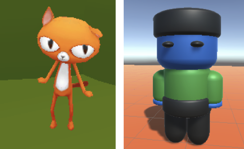
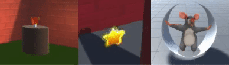
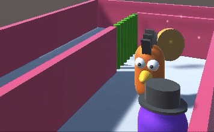
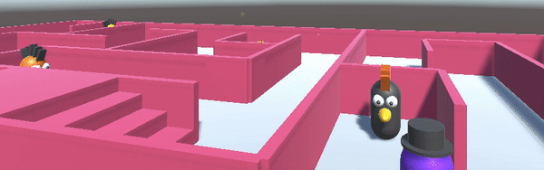

## Second quest

Add another NPC with a different quest and reward. You can choose from different quest types.  

{:width="300px"}

If quests are revealed and then completed in a specific sequence, this is called **linear** gameplay or storytelling. If the player can choose the order in which they complete quests, then this is **non-linear** gameplay. Some games mix linear and non-linear gameplay or storytelling. Quests that must be completed are called **main quests** and optional extra quests are called **side quests**. 

--- task ---

**Design:** Design your second quest. The quests will be **non-linear** so they can be started in any order. 

### Quest type

You quest could be:
+ A **gather** quest with multiple items of the same kind
+ A **recipe** or **crafting** quest with multiple items of different kinds 
+ An **escort** quest where you have to find another NPC and have them follow the player back to the Quest Giver (or to another location)
+ A **deliver** quest where you are given an object to take to another NPC 
+ A **story** quest where you have to find and talk to another NPC to find out information
+ A **puzzle** or **task** quest where you have to solve a puzzle or complete a task

### Reward type

The reward could be given by the new Quest Giver or another NPC and could be:
+ Experience points (XP), reputation, coins, gems, or another in-game currency
+ An accessory for the Player 
+ Unlocking an new area or item in the game 

Or, a combination of these. 

--- /task ---

**Software design** is making decisions about how to turn your idea into code. In Unity, this means deciding on the GameObjects, scripts, variables, and methods you will need to build your game or interactive story. 

### Quest checklist

For your quest, you will need to:
+ Add a new NPC to be the Quest Giver with UI objects to communicate about the quest 
+ Update the QuestSeeker script on the Player with variables to store the state of the new quest 
+ Add items and other NPCs depending on the quest type
+ Add a script to the Quest Giver NPC to control the conversation and reward based on the state of the quest
+ Add scripts to items and other NPCs according to the quest type

--- task ---

### The Quest Giver

Add a new GameObject to be the second Quest Giver NPC. 

**Choose:**

--- collapse ---

---
title: Duplicate your first NPC and make changes to it
---

Right-click on the **Quest Giver GameObject** you created for the first quest and select **Duplicate**. This creates a copy of your Quest Giver GameObject with all the child GameObjects. 

The Quest Giver GameObject will be created in the same position, so use the Scene view or Inspector to position it somewhere else. 

Remove the existing QuestGiver script component from the Inspector by clicking on the three dots and selecting **Remove Component**.

--- /collapse ---

--- collapse ---

---
title: Add a new Quest Giver NPC GameObject
---

Choose a model or create a new Quest Giver NPC GameObject out of 3D shapes.  

Add a **Box Collider** so that the Player cannot walk through the new Quest Giver NPC and a second **Box Collider**, that is bigger than the first, with **IsTrigger** checked. 

Right-click on the **Canvas** for your first NPC and choose **copy**. Then, right-click on your new **Quest Giver NPC** and choose **Paste as Child**. This will make a copy of the UI objects for your new Quest Giver.

--- /collapse ---

In the Inspector:
+ Edit the text in the message on your new Quest Giver NPC Canvas to describe your new quest. Change the text style to suit your new character. 
+ Edit the text in the Name object to match your new NPC.

--- collapse ---

---
title: Create a new script for the Quest Giver NPC
---

**QuestGiver2** script:

--- code ---
---
language: csharp
filename: QuestGiver2.cs
line_numbers: false
line_number_start: 
line_highlights: 
---
using TMPro;

public class QuestGiver2 : MonoBehaviour
{
    public GameObject canvas;
    public GameObject button;
    public QuestSeeker player;

    // Start is called before the first frame update
    void Start()
    {
        Debug.Log("Quest giver 2 start"); // Update with the name of your quest
        canvas.SetActive(false);
    }

    void OnTriggerEnter(Collider other)
    {
        if (other.CompareTag("Player"))
        {
            canvas.SetActive(true);
        }
    }

    void OnTriggerExit(Collider other)
    {
        if (other.CompareTag("Player"))
        {
            canvas.SetActive(false);
        }
    }

    public void QuestAccepted()
    {
        Debug.Log("Quest 2 accepted"); // Update with the name of your quest

        canvas.SetActive(false);
        button.SetActive(false);
    }
}
--- /code ---

--- /collapse ---

In the Inspector, make sure you are updating the child objects and components for your new Quest Giver NPC, and:
+ Drag the **Canvas**, **Message**, and **Button** objects to your new script
+ Select the **Button** and add an **OnClick** set to the `QuestAccepted` method of your new script

--- /task ---

--- task ---

**Test:** Play your scene:
+ Make sure you see the new quest message 
+ Check that you can accept the quest with the button
+ Check that you can see the debug message in the Console

--- /task ---

--- task ---

### The quest items and/or NPCs

Depending on the type of quest you have chosen, add or create the GameObjects that you will use as collectables, followers, or rewards and position them in your scene. 

Add a **Box Collider** component to your Item GameObject that is bigger than any other colliders on your Item and check the **IsTrigger** Box Collider property.

**Choose:** Add visual effects to your collectables, followers, or rewards.

[[[unity-particle-system]]]

[[[unity-gameobject-spin]]]

You could also add the **IdleWalk** animation or create a new Animator. 

[[[unity-animation]]]

If your quest has multiple items that need to be deactivated and activated at the same time, then add the same tag to each of them. 

--- collapse ---

---
title: Tag your items
---

**Create a new tag:** Go to the Tag property at the top of the Inspector window and **Add Tag**. Click on the **+** and add a tag for your quest, for example 'KeyQuest'. This will allow you to find all the GameObjects with the same tag so you can activate and deactivate them.

**Apply your new tag:** Select the GameObjects that are items in this quest in the Hierarchy window and use the Tag drop-down box to select your new tag from the list.

--- /collapse ---

**Tip:** If all of your collectables, followers, or rewards will look and act in the same way, make sure you add all your effects before duplicating the first GameObject. 

--- /task ---

### Controlling the quest

Set up the quest using initial visibility, trigger reactions, and tracking of quest states. 

--- task ---

### Before the quest is accepted

Set up your quest by hiding any GameObjects that should be hidden until the quest is accepted. 

**Choose:**

--- collapse ---

---
title: Hide items with the same tag
---

**QuestGiver2** script

--- code ---
---
language: csharp
filename: QuestGiver2.cs
line_numbers: false
line_number_start: 
line_highlights: 
---
GameObject[] collectables;

    // Start is called before the first frame update
    void Start()
    {
        canvas.SetActive(false);

        collectables = GameObject.FindGameObjectsWithTag("Collectables");
        foreach (var Collectables in collectables)
        {
            Collectables.SetActive(false);
        }
    }
--- /code ---

--- /collapse ---

--- collapse ---

---
title: Hide individual items
---

**QuestGiver2** script

--- code ---
---
language: csharp
filename: QuestGiver2.cs
line_numbers: false
line_number_start: 
line_highlights: 
---
    public GameObject iceDome;

    void Start()
    {
        // Don't show the quest message at the start
        canvas.SetActive(false);
        iceDome.SetActive(false);
    }
--- /code ---

Assign GameObjects to variables in the Unity Editor.  

--- /collapse ---

--- collapse ---

---
title: Set visibility of child items
---

**QuestGiver2** script:

--- code ---
---
language: csharp
filename: QuestGiver2.cs
line_numbers: false
line_number_start: 
line_highlights: 
---
public GameObject telescope; // Item on NPC
public GameObject playerTelescope; // Item on Player
public PlayerController player;

void Start()
{
    telescope.SetActive(true);
    playerTelescope.SetActive(false);
    canvas.SetActive(false);
}
--- /code ---

--- /collapse ---

--- /task ---

--- task ---

### When quest accepted

Add a `QuestAccepted` method to your new Quest Giver NPC to set up the quest when it has been accepted. Connect the method to the 'Accept' button for the quest. 

**Choose:**

--- collapse ---

---
title: Make an individual item appear
---

**QuestAccepted** method of **QuestGiver2** script:

--- code ---
---
language: csharp
filename: QuestGiver2.cs
line_numbers: false
line_number_start: 
line_highlights: 
---
        key.SetActive(true);
--- /code ---

--- /collapse ---

--- collapse ---

---
title: Make multiple items with the same tag appear
---

`QuestAccepted` method of **QuestGiver2** script:

--- code ---
---
language: csharp
filename: QuestGiver2.cs
line_numbers: false
line_number_start: 
line_highlights: 
---
    foreach (var Collectable in collectables)
    {
        Collectable.SetActive(true);
    }
--- /code ---

--- /collapse ---

--- collapse ---

---
title: Make a child item appear on the player
---

--- code ---
---
language: csharp
filename: QuestGiver2.cs
line_numbers: true
line_number_start: 
line_highlights: 
---
    void OnTriggerEnter(Collider other)
    {
        if (other.CompareTag("Player"))
        {
            // Transfer item to player for delivery
            telescope.SetActive(false);
            playerTelescope.SetActive(true);
        }
    }
--- /code ---

--- /collapse ---

--- collapse ---

---
title: Update a variable to say the quest has been accepted
---

**QuestSeeker** script:

--- code ---
---
language: csharp
filename: QuestSeeker.cs
line_numbers: false
line_number_start: 
line_highlights: 
---
    // The follower should only follow if the quest has been accepted
    public bool followQuestAccepted = false;

    void QuestAccepted()
    {
        followQuestAccepted = true;
    }
--- /code ---

--- /collapse ---

--- /task ---

--- task ---

### During the quest

Update the **QuestSeeker** script used by the Player with variables to keep track of the status of the quest such as items collected, items delivered, or NPC following.

**Choose:**

--- collapse ---

---
title: Add variables for multiple items of the same type in a gather quest
---

In a gather quest, the player collects multiple items of the same kind. 

**QuestSeeker** script:

--- code ---
---
language: csharp
filename: QuestSeeker.cs
line_numbers: false
line_number_start: 
line_highlights: 
---
// Add a variable to store the amount collected
public int collectables = 0;
--- /code ---

--- /collapse ---

--- collapse ---

---
title: Add variables for multiple different items in a craft or recipe quest
---

In a recipe or craft quest, the player collects multiple items of different kinds to make a recipe or craft a new item. 

**QuestSeeker** script:

--- code ---
---
language: csharp
filename: QuestSeeker.cs
line_numbers: false
line_number_start: 
line_highlights: 
---
// Add a variable for each item to be collected
public bool hasIceBlock = false;
public bool hasIceTool = false;
--- /code ---

--- /collapse ---

--- collapse ---

---
title: Add variables for a follower
---

In an escort quest, the player will need to take a follower with them. 

**QuestSeeker** script:

--- code ---
---
language: csharp
filename: QuestSeeker.cs
line_numbers: false
line_number_start: 
line_highlights: 
---
// To control when the follower is following the player
public bool friendFollower = false;
--- /code ---

--- /collapse ---

--- /task ---

--- task ---

Add a script to each quest item or other NPC involved in the quest so that they react when the Player collides with them.

You could also check a `bool` variable and only react to the Player if the quest has been accepted. 

**Choose:**

--- collapse ---

---
title: Gather quest items
---

Here's an example for a coin collection quest, each coin will need this script. 

--- code ---
---
language: csharp
filename: CoinController.cs
line_numbers: false
line_number_start: 
line_highlights: 
---
public class CoinController : MonoBehaviour
{
    public QuestSeeker player;

    void OnTriggerEnter(Collider other)
    {
        if (other.CompareTag("Player"))
        {
            player.collectables += 1;
            gameObject.SetActive(false);
        }
    }
}
--- /code ---

--- /collapse ---

--- collapse ---

---
title: Collect recipe or crafting quest items
---

Here's an example for an IceTool, the same project also has a IceBlock collectable GameObject with a similar script. 

--- code ---
---
language: csharp
filename: IceToolController.cs
line_numbers: false
line_number_start: 
line_highlights: 
---
public class IceToolController : MonoBehaviour
{
    public QuestSeeker player;

    void OnTriggerEnter(Collider other)
    {
        if (other.CompareTag("Player"))
        {
            player.hasIceTool = true;
            gameObject.SetActive(false);
        }
    }
}
--- /code ---

--- /collapse ---

--- collapse ---

---
title: Escort quest followers
---

Here's an example for a follower, if the same project has other follower GameObjects, they will need the script too. 

--- code ---
---
language: csharp
filename: FollowController.cs
line_numbers: false
line_number_start: 
line_highlights: 
---
public class FollowerController : MonoBehaviour
{
    public QuestSeeker player;
    float followSpeed = 3f;
    float followDistance = 1.6f;

    void Update()
    {
        transform.LookAt(player.transform);

        if(player.escortQuestAccepted == true && Vector3.Distance(player.transform.position, transform.position) > followDistance)
        {
                CharacterController controller = GetComponent<CharacterController>();
                var moveDirection = Vector3.Normalize(player.transform.position - transform.position);
                controller.SimpleMove(moveDirection * followSpeed);
        }
    }

    void OnTriggerEnter(Collider other)
    {
        if (other.CompareTag("Player"))
        {
            player.friendFollower = true;
        }
    }
}
--- /code ---

--- /collapse ---

--- collapse ---

---
title: Make a child item transfer or disappear
---

On the script for the NPC to receive the item: 

--- code ---
---
language: csharp
filename: QuestGiver.cs
line_numbers: false
line_number_start: 
line_highlights: 
---
void OnTriggerEnter(Collider other)
    {
        if (other.CompareTag("Player"))
        {
            telescope.SetActive(true);
            playerTelescope.SetActive(false);
        }
    }
--- /code ---

--- /collapse ---

--- collapse ---

---
title: Only react if the player has accepted the quest
---

**FollowerNPC** script:

--- code ---
---
language: csharp
filename: FollowNPC.xs
line_numbers: false
line_number_start: 
line_highlights: 
---
    void Update()
    {
        if(player.escortQuestAccepted)
        {
            // Follow Player
        }
    }
--- /code ---

--- /collapse ---

--- /task ---

### Quest completion

Set up the reaction of the Quest Giver on completion of the quest, apply rewards, and make sure the quest can't be offered again. 

--- task ---

The Quest Giver NPC needs to check for completion of the quest and thank the Player.

--- collapse ---

---
title: Check whether the Player has enough of the same item
---

--- code ---
---
language: csharp
filename: QuestGiver.cs
line_numbers: false
line_number_start: 
line_highlights: 
---
    if (player.coins >= 3) // If all the coins have been collected
    {
        message.SetText("Well done, you collected the coins!");
              
    }
--- /code ---

--- /collapse ---

--- collapse ---

---
title: Check whether the Player has multiple different items
---

--- code ---
---
language: csharp
filename: QuestGiver.cs
line_numbers: false
line_number_start: 
line_highlights: 
---
    if (player.hasIceBlock && player.hasIceTool)
    {
        // Change to a successful completion message
        message.SetText("Thank you for helping me finish my ice dome. You can climb it if you like.");
    }
--- /code ---

--- /collapse ---

**Tip:** You can use Boolean AND `&&` and Boolean OR `||` to combine condition checks.

--- /task ---

--- task ---

**Choose:** What happens when your player completes a quest? 

--- collapse ---

---
title: Currency or experience
---

You could use coins or a different currency for your game. Or you could reward the player with XP (experience points).

Keep track of currency or points rewards by using a variable on the QuestSeeker script and have the QuestGiver scripts update it when a quest is completed. 

--- code ---
---
language: csharp
filename: QuestSeeker.cs
line_numbers: false
line_number_start: 
line_highlights: 
---
public int gems; // Keep track of gems 
--- /code ---

--- code ---
---
language: csharp
filename: QuestSeeker.cs
line_numbers: false
line_number_start: 
line_highlights: 
---
player.gems += 2; // Give a reward to the player
--- /code ---

--- /collapse ---

--- collapse ---

---
title: An accessory or follower
---

You could use `SetActive` to enable a child item to show an accessory such as a hat. You will need to create a public variable on the Quest Giver NPC to store the child item and drag it to the Inspector.

--- code ---
---
language: csharp
filename: QuestGiver.cs
line_numbers: false
line_number_start: 
line_highlights: 
---
public GameObject hat;
--- /code ---

Then use `SetActive` when the quest has been completed. 

--- code ---
---
language: csharp
filename: QuestGiver.cs
line_numbers: false
line_number_start: 
line_highlights: 
---
hat.SetActive(true)
--- /code ---

You could also make an NPC character become a follower or a pet by changing the variable that they check to decide whether to follow the player. 

--- code ---
---
language: csharp
filename: QuestGiver.cs
line_numbers: true
line_number_start: 
line_highlights: 
---
player.dogFollowing = true;
--- /code ---

--- /collapse ---

--- collapse ---

---
title: Unlock
---

A type of reward could be to remove a barrier or get access to an area or items that were not available previously.

Think about the GameObjects you want to remove. Create and apply a new 'Unlock' tag to them.

Open your QuestGiver script and create a variable to store the Unlock GameObjects:

--- code ---
---
language: csharp
filename: QuestGiver.cs
line_numbers: false
line_number_start: 
line_highlights: 
---
    public GameObject[] unlock;
--- /code ---

Add code to the `Start()` method to turn the items on at the start.

--- code ---
---
language: csharp
filename: QuestGiver.cs
line_numbers: false
line_number_start: 
line_highlights: 
---
        unlock = GameObject.FindGameObjectsWithTag("Unlock");

        foreach (var Unlock in unlock)
        {
            Unlock.SetActive(true);
        }
--- /code ---

Create an unlock script and attach it to a new NPC quest ally or to a new unlock item. 

--- code ---
---
language: csharp
filename: Unlock.cs
line_numbers: false
line_number_start: 
line_highlights: 
---
public class Unlock : MonoBehaviour
{
    public GameObject canvas;
    public AudioClip collectSound;
    public QuestGiver unlock;

    // Start is called before the first frame update
    void Start()
    {      
        canvas.SetActive(false);
    }

    void OnTriggerEnter(Collider other)
    {
        if (other.CompareTag("Player"))
        {        
            canvas.SetActive(true);
            AudioSource.PlayClipAtPoint(collectSound, transform.position);

            foreach (var Unlock in unlock.unlock)
            {
                Unlock.SetActive(false);
            }
        }
    }

    void OnTriggerExit(Collider other)
    {
        if (other.CompareTag("Player"))
        {
            canvas.SetActive(false);
        }
    }
}
--- /code ---

You could also introduce a new NPC quest enemy or a new lock item to replace the barriers.

--- /collapse ---

--- /task ---

--- task ---

The second Quest Giver NPC needs to check whether the Player has completed the quest and then give them the reward.

--- /task ---

--- task ---

Make sure the reward can't be given more than once.

--- collapse ---

---
title: Remove items from the Player
---

--- code ---
---
language: csharp
filename: QuestGiver.cs
line_numbers: false
line_number_start: 
line_highlights: 
---
    // Make sure the reward can't be given again
    player.hasIceBlock = false;
    player.hasIceTool = false;
--- /code ---

--- /collapse ---

--- collapse ---

---
title: Reset quest variables
---
--- code ---
---
language: csharp
filename: QuestGiver.cs
line_numbers: false
line_number_start: 
line_highlights: 
---
    player.escortQuestAccepted = false;
--- /code ---

--- /collapse ---

--- /task ---

### Debug your quest

--- task ---

**Debug:** You might find some bugs in your project that you need to fix. 

Always check the Console for errors in your scripts. Unity gives helpful error messages for lots of common problems and you can often click on the error message to go straight to the problem.

--- collapse ---

---
title: My new Quest Giver displays the wrong message
---

Select the Quest Giver and find its script component. Make sure that the correct GameObjects (the ones for this quest that are child objects of the Quest Giver) are used. If you click on an attached GameObject in the Inspector then that object will be highlighted in the Hierarchy. 

Check that you have changed:
+ The quest text in the Message TextMeshPro GameObject
+ The quest completion text in the `OnTriggerEnter` method that gets set when the quest is completed

If the Quest Giver isn't showing the quest complete message when you think the quest has been completed, then check your code carefully. Are you correctly updating the quest state in the QuestSeeker script and correctly checking it in the QuestGiver script for this Quest Giver?

Add `Debug.Log()` statements and check that the values change in the Inspector during Play mode when you expect them to.

--- /collapse ---

--- collapse ---

---
title: Nothing happens when I click the Accept button
---

Select your Quest Giver NPC and make sure they have a script that has an `AcceptQuest` method.

Check that all the variables are set on the script in the Inspector. 

Click on the **Button** object and check that you have attached the correct method such as `AcceptQuest` to an **OnClick Event**. 

Add a `Debug.Log("Quest accepted");` line to the method and check the Console to see that the method is being called.

If you are sure the method is being called, check that the code in the method is correct. 

If the method is not being called (no Debug output), then make sure you have an `EventSystem` GameObject in your project. If you accidentally delete this, then button-clicks won't be handled. If it's missing, right-click in the Hierarchy and choose **UI** then **Event System**.

--- /collapse ---

--- collapse ---

---
title: My collectable doesn't disappear
---

Check that the collectable has a script with an `OnTriggerEnter` method that deactivates the collectable if the Player collides with it. 

Make sure you have added a Box Collider with a Trigger and that the collider is bigger than the non-trigger colliders so that the Player is able to trigger it. 

Check that the Player GameObject has the Player tag.

--- /collapse ---

--- collapse ---

---
title: My follower doesn't follow
---

Check that you have added a Character Controller component and a script to control the follower's movement. 

Make sure that the script has access to the Player, if you are using a public variable for the Player then check that you have assigned it in the Inspector. 

Check that the conditions to follow the player are true. Use `Debug.Log()` statements and check variables in the Inspector. 

Make sure that the follower is detecting the collision with the player. Make sure the follower has a Box Collider with a Trigger and that this collider is bigger than other colliders. 

--- /collapse ---

[[[unity-physics-colliders]]]

[[[unity-animation]]]

--- /task ---

--- save ---
