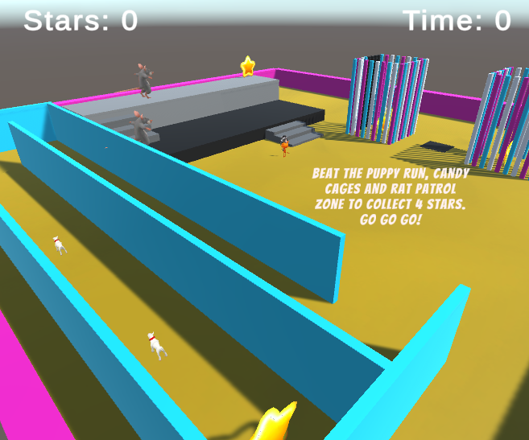

## What next?

If you are following the [Intro to Unity](https://projects.raspberrypi.org/en/raspberrypi/unity-intro) path, you can move on to the [3D Adventure](https://projects.raspberrypi.org/en/projects/3d-adventure) project. In this project, you will create a 3D adventure with a goal that the player needs to achieve. Your 3D adventure could be a game, a virtual world or a visual novel with a goal and one or more endings.

[Minigames](https://raspberrypilearning.github.io/unity-webgl/minigames){:target=blank}.

<iframe allowtransparency="true" width="710" height="450" src="https://raspberrypilearning.github.io/unity-webgl/minigames/" frameborder="0"></iframe>
