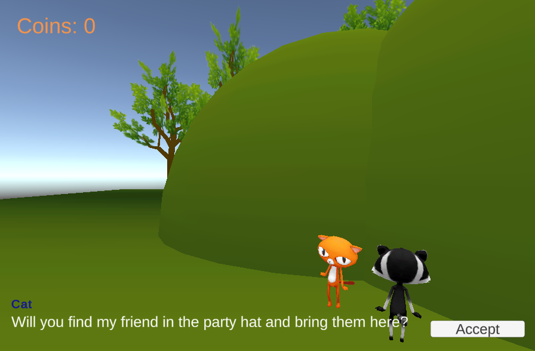
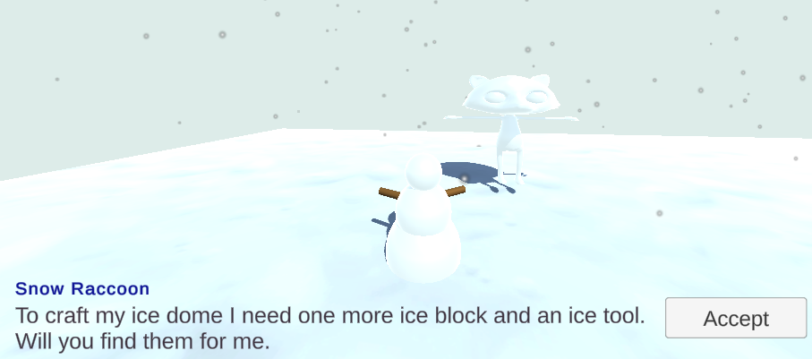

## Ce que tu vas faire

Dans ce projet, tu ajouteras des PNJ et des quêtes au monde que tu as créé dans le projet [Bâtisseur de mondes](https://projects.raspberrypi.org/en/projects/world-builder){:target='_blank'}.

Ce projet t'est présenté grâce au soutien généreux de [Unity Technologies](https://unity.com/){:target="_blank"}.  Ces [projets](https://projects.raspberrypi.org/en/pathways/unity-intro){:target="_blank"} proposent aux jeunes de faire leurs premiers pas dans la création de mondes virtuels en 3D temps réel.

Une **quête** est une tâche ou une mission dans un jeu vidéo que le joueur peut accomplir pour obtenir une récompense ou faire avancer l'histoire. Les quêtes peuvent demander au joueur d'aller chercher ou de livrer un objet, de rassembler des objets, d'escorter un personnage jusqu'à un endroit, de trouver des informations ou de résoudre une énigme. Lorsqu'il a terminé, le joueur peut être récompensé par de l'expérience, des pièces, l'accès à de nouvelles zones ou de nouvelles capacités.

Tu vas :
+ Ajouter un PNJ avec des dialogues qui changent en fonction de l'état du jeu
+ Gérer l'état d'une quête à l'aide d'une ou plusieurs variables
+ Donner un comportement au joueur et aux PNJ pour accomplir une ou plusieurs quêtes (rassembler, escorter, livrer)

--- no-print ---

### Joue ▶️

--- task ---

Joue les quêtes du projet d'exemple. Réfléchis au type de quête et à son résultat.
+ Quelle est la récompense pour avoir accompli la quête ?
+ Comment les PNJ interagissent-ils avec le joueur ?
+ Comment les objets sont-ils utilisés dans la quête ?

[Snow quest](https://raspberrypilearning.github.io/unity-webgl/SnowQuest){:target='_blank'}

<iframe allowtransparency="true" width="710" height="450" src="https://raspberrypilearning.github.io/unity-webgl/SnowQuest" frameborder="0"></iframe>

{:width="400px"}

--- /task ---

### Trouver des idées 💭

Tu vas prendre des décisions de conception pour créer tes quêtes.

--- task ---

Explore ces exemples de projets pour obtenir plus d'idées :

Maze quest :[Essaie-le](https://raspberrypilearning.github.io/unity-webgl/maze-quest-seeker){:target='_blank'} 
{:width="400px"}

Hill Quest :[Essaie-le](https://raspberrypilearning.github.io/unity-webgl/HillQuest){:target='_blank'}
{:width="400px"}

Pour découvrir comment ces projets ont été réalisés, télécharge et décompresse les [packages Unity](https://rpf.io/p/en/quest-seeker-get){:target='_blank'} puis importe chacun d'entre eux dans un nouveau projet 3D Unity.

[[[unity-create-3d-project]]]

[[[unity-importing-a-package]]]

--- /task ---

--- /no-print ---

--- print-only ---

### Trouve l'inspiration 💭

Tu vas prendre des décisions de conception pour créer tes quêtes.

Utilise ces images d'exemple pour avoir plus d'idées :

Snow quest : https://raspberrypilearning.github.io/unity-webgl/SnowQuest {:width="400px"}

Maze quest : https://raspberrypilearning.github.io/unity-webgl/maze-quest-seeker {:width="400px"}

Hill quest : https://raspberrypilearning.github.io/unity-webgl/HillQuest {:width="400px"}

--- /print-only ---

