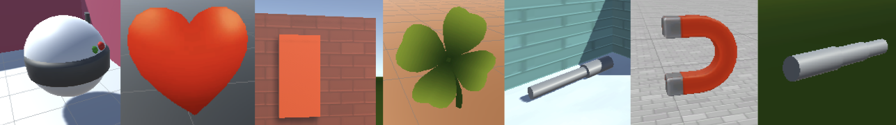
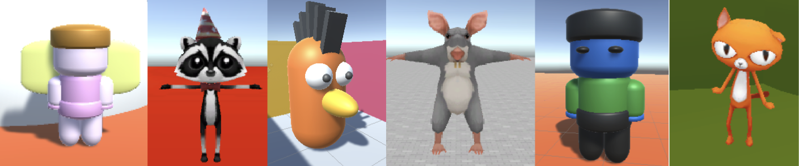
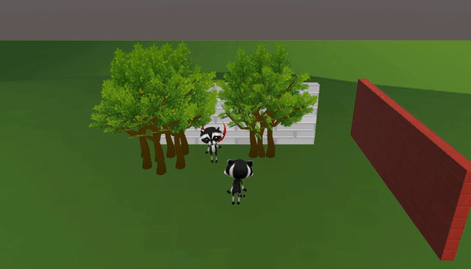
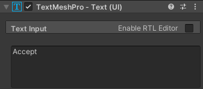
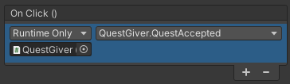
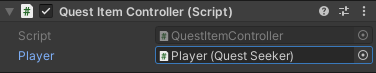

## Première quête

La première quête sera une **quête de collecte** où un personnage non-joueur (PNJ) demande au joueur de trouver un objet et de le lui rapporter. 

Lorsque le joueur retourne auprès du donneur de quête, il reçoit des points d'expérience (XP) ou une récompense dans la devise de ton jeu.

{:width="300px"}

--- task ---

Ce projet s'appuie sur le projet que tu as réalisé dans le projet [Bâtisseur de mondes](https://projects.raspberrypi.org/en/projects/world-builder){:target='_blank'}.

Ouvre ton projet pour l'utiliser comme monde, ou carte, où les quêtes se dérouleront.

--- /task ---

Un **Game Designer** crée les personnages, les règles, les objectifs, les mécanismes de jeu et les énigmes qui rendent un jeu agréable et engageant pour le joueur. Certains Game Designers réalisent tout le codage de leur jeu et d'autres travaillent en équipe.

--- task ---

**Conception :** pense à une quête qui a du sens dans le monde que tu as construit.

Tu devras décider sur :
+ Un élément à rechercher
+ Un personnage non-joueur (PNJ) qui donne la quête au joueur
+ Les messages que le PNJ doit afficher avant et après l'accomplissement de la quête
+ Une récompense en points d'expérience ou en monnaie (pièces ou gemmes) dans ton jeu

--- /task ---

--- task ---

Ajoute un GameObject pour l'objet que le joueur devra aller chercher.

Positionne l'objet dans ton monde de façon à ce que le joueur doive se déplacer de sa position de départ pour le trouver.

**Choisir :**

[[[unity-item-model]]]

[[[unity-item-3d-shapes]]]

--- /task ---

--- task ---

Ajoute un PNJ qui sera un donneur de quêtes et place-le de façon à ce que le joueur puisse le trouver facilement.

**Choisir :**

[[[unity-npc-model]]]

[[[unity-npc-3d-shapes]]]

--- /task ---

--- task --- Si tu choisis Cat, Rat ou Raccoon, tu peux alors définir l'**Animator Controller** sur l'animation **IdleWalk**.

--- /task ---

--- task ---

Ajoute un **Box Collider** au **Donneur de quête** afin que le joueur ne puisse pas les traverser.

--- /task ---

Le donneur de quête proposera au joueur une quête lorsqu'il s'en approchera suffisamment.

--- task --- Vérifie que ton GameObject Joueur possède le tag Joueur. --- /task ---

--- task ---

Ajoute un UI **TextMeshPro** nommé `Texte de la quête` en tant qu'**enfant du donneur de quête** et ajoutes-y ton message de quête.

--- collapse ---

---
title: Ajouter et positionner le texte TextMeshPro
---

Modifie le texte du message, les paramètres et la position de l'objet texte jusqu'à ce que tu sois satisfait :

 

Tu peux ajouter un autre UI **TextMeshPro** sur le même canvas avec le nom du PNJ Donneur de quête si tu le souhaites.

--- /collapse ---

[[[unity-ui-positioning-2d]]]

--- /task ---

--- task ---

Ajoute un **Box Collider** avec un **Trigger** et un script **QuestGiver** sur le PNJ Donneur de quête pour faire apparaître le message de la quête lorsque le joueur se trouve à proximité.

{:width="400px"}

--- collapse ---

---
title: Faire apparaître un message lorsque le joueur est suffisamment proche
---

Ajoute un autre **Box Collider** avec la propriété Trigger cochée. Ce Box Collider doit être plus grand que le premier Box Collider pour que le joueur puisse déclencher l'affichage d'une zone de texte par le donneur de quête.

Ajoute un script appelé **QuestGiver** au GameObject **DonneurQuete**. Ajoute les méthodes `OnTriggerEnter` et `OnTriggerExit` pour afficher et masquer le message canvas lorsque le joueur se rapproche et s'éloigne.

Ajoute du code à un script sur le GameObject PNJ.

--- code ---
---
language: csharp filename: QuestGiver.cs line_numbers: false line_number_start: 5
line_highlights: 7-23, 27
---

public class QuestGiver : MonoBehaviour
{ public GameObject canvas;

    void OnTriggerEnter(Collider other)
    {
        if (other.CompareTag("Player"))
        {
            canvas.SetActive(true);
        }
    }
    
    void OnTriggerExit(Collider other)
    {
        if (other.CompareTag("Player"))
        {
            canvas.SetActive(false);
        }
    }
    // Start is called before the first frame update
    void Start()
    {
        canvas.SetActive(false);
    }
} --- /code ---

Sélectionne le GameObject **DonneurQuete**. Dans l'Inspector, trouve le composant de script **QuestGiver** et fais glisser le **Canvas** du PNJ vers la propriété Canvas du script.

--- /collapse ---

--- /task ---

--- task ---

**Test :** joue ta scène :
+ Vérifie que le joueur ne peut pas passer à travers le donneur de quête
+ Assure-toi que le message de la quête s'affiche lorsque le joueur est près du donneur de quête

**Déboguer :**

[[[unity-collider-error]]]

[[[unity-trigger-error]]]

--- /task ---

Pour cette quête, l'objet à collecter ne doit apparaître qu'une fois la quête acceptée.

--- task ---

Ajoute un **Bouton Accepter** au Canvas de ton PNJ donneur de quête et connecte-le à une méthode `QueteAcceptee` sur ton script **QuestGiver**. Mets à jour le script **QuestGiver** pour que l'objet n'apparaisse que lorsque la quête a été acceptée.

{:width="400px"}

--- collapse ---

---
title: Faire apparaître un Item GameObject lorsqu'on clique sur un bouton
---

Ajoute un UI **TextMesh Pro Button** sur le même canvas et clique sur l'objet enfant **Text (TMP)** du bouton puis donne-lui le texte `Accepter` :

Ajuste la taille, la position et les couleurs des boutons et du texte jusqu'à ce qu'ils te conviennent :

Ajoute du code au script QuestGiver pour contrôler le moment où l'objet apparaît, de sorte qu'il n'apparaisse que lorsque la quête a été acceptée.

--- code ---
---
language: csharp filename: QuestGiver.cs line_numbers: false line_number_start: 6
line_highlights: 9, 10, 30, 39
---
public class QuestGiver : MonoBehaviour
{ public GameObject canvas; public GameObject button; public GameObject item;

    void OnTriggerEnter(Collider other)
    {
        if (other.CompareTag("Player"))
        {
            canvas.SetActive(true);
        }
    }
    
    void OnTriggerExit(Collider other)
    {
        if (other.CompareTag("Player"))
        {
            canvas.SetActive(false);
        }
    }
    
    public void QuestAccepted()
    {
        item.SetActive(true); // Make the quest item appear
        canvas.SetActive(false); // Hide the message when the quest has been accepted
        button.SetActive(false); // Don't show the button after the quest has been accepted
    }
    
    // Start is called before the first frame update
    void Start()
    {
        canvas.SetActive(false);
        item.SetActive(false);
    }
--- /code ---

Sélectionne le **Donneur de quête**, puis dans le composant de script **QuestGiver** de la fenêtre Inspector, fais glisser tes GameObjects **Button** et **Item** vers les propriétés Button et Item :

Dans la fenêtre Hierarchy, sélectionne le **GameObject Button** puis va sur la propriété `OnClick()` de la fenêtre Inspector et clique sur le **+**.

Clique sur le cercle du champ situé sous « Runtime », clique sur **Scene** et choisis ton **Donneur de Quête**. Dans le menu déroulant Function, sélectionne **QuestGiver.QueteAcceptee** pour joindre ta nouvelle méthode à l'événement de clic du bouton :

--- /collapse ---

**Astuce :** si tu as un Canvas comme objet enfant, alors tu ne pourras pas te focaliser sur le GameObject parent dans la vue Scene. Pour résoudre ce problème, tu peux désactiver le Canvas dans l'Inspector, en décochant la case à côté de son nom. Si tu as besoin de revoir le Canvas pour le modifier, tu peux cocher la case.

--- /task ---

--- task ---

**Test :** joue ta scène :
+ Vérifie que ton objet n'apparaît pas au début
+ Va parler au donneur de quête et accepte la quête
+ Assure-toi que l'objet apparaît lorsque la quête est acceptée
+ Vérifie également que le bouton « Accepter » disparaît et ne s'affiche plus si tu retournes voir le donneur de quête

**Déboguer :**

--- collapse ---

---
title: Rien ne se passe lorsque je clique sur le bouton Accepter
---

Sélectionne ton **PNJ Donneur de quête** et assure-toi qu'il a un script qui a une méthode `QueteAcceptee`.

Vérifie que toutes les variables sont définies sur le script dans l'Inspector.

Clique sur l'objet **Button** et vérifie que tu as attaché la bonne méthode telle que `QueteAcceptee` à un événement `OnClick`.

Ajoute une ligne `Debug.Log("Quête acceptée");` à la méthode et vérifie dans la console que la méthode est bien appelée.

Si tu es sûr que la méthode est appelée, vérifie que le code de la méthode est correct.

Si la méthode n'est pas appelée (pas de sortie Debug), alors vérifie que tu as un GameObject `EventSystem` dans ton projet. Si tu le supprimes accidentellement, les clics sur les boutons ne seront pas pris en compte. S'il est manquant, fais un clic droit dans la fenêtre Hierarchy et choisis **UI** puis **Event System**.

--- /collapse ---

--- /task ---

Lorsque le joueur ramasse l'objet, celui-ci doit disparaître et éventuellement produire un effet sonore. Le donneur de quête devra également savoir quand la quête a été accomplie.

--- task ---

Ajoute un UI **TextMeshPro** à la scène pour afficher la récompense. Ajoute un script **QuestSeeker** au joueur pour stocker et mettre à jour la récompense.

--- collapse ---

---
title: Ajouter un script QuestSeeker au joueur pour gérer la récompense
---

Fais un clic droit dans la fenêtre Hierarchy et ajoute un UI **TextMeshPro** à ta scène pour afficher la récompense. Nomme le nouvel objet `Texte pièce`, ou un nom approprié pour ta récompense.

Ajoute un nouveau composant de script **QuestSeeker** au joueur pour stocker et afficher la récompense.

La variable `pieces` doit être `public` pour qu'un script sur l'objet de quête puisse la mettre à jour.

--- code ---
---
language: csharp filename: QuestSeeker.cs line_numbers: false line_number_start: 4
line_highlights: 4, 8, 9, 20
---
using TMPro;

public class QuestSeeker : MonoBehaviour
{ public int coins = 0; // Or the reward for your quest public TMP_Text coinText;

    // Start is called before the first frame update
    void Start()
    {
    
    }
    
    // Update is called once per frame
    void Update()
    {
       coinText.SetText("Coins: " + coins); 
    }
} --- /code ---

--- /collapse ---

L'objet Joueur étant sélectionné, fais glisser l'objet **Texte piece TextMeshPro** sur la propriété Texte piece dans l'Inspector.

--- /task ---

--- task ---

Ajoute une variable `public bool aObjetQuete = false;` au script **QuestSeeker**. La variable doit être `publique` pour qu'un script sur l'objet la définisse sur `true` lorsque l'objet est collecté.

--- collapse ---

---
title: Ajouter une variable aObjetQuete au script QuestSeeker
---

--- code ---
---
language: csharp filename: QuestSeeker.cs line_numbers: false line_number_start: 4
line_highlights: 8
---
using TMPro;

public class QuestSeeker : MonoBehaviour
{ public bool hasQuestItem = false; public int coins = 0; public TMP_Text coinText;

    // Update is called once per frame
    void Update()
    {
       coinText.SetText("Coins: " + coins); 
    }
} --- /code ---

--- /collapse ---

--- /task ---

--- task ---

Ajoute un **Box Collider** avec un **Trigger** et un script **QuestItemController** à ton objet de quête. Ajoute du code pour cacher l'objet de quête et définis `aObjetQuete` sur true sur le script QuestSeeker du joueur lorsque le joueur entre en collision avec l'objet de quête.

{:width="400px"}

--- collapse ---

---
title: Faire disparaître l'objet et attribuer la valeur true à aObjetQuete
---

Sélectionne l'**objet de quête** et ajoute un **Box Collider** avec un **Trigger**.

Ajoute un **script** à l'**objet de quête** et nomme-le `ControlleurObjetQuete`.

Ajoute du code pour que l'objet se cache et mette à jour le statut `aObjetQuete` sur le joueur.

--- code ---
---
language: csharp filename: QuestItemController.cs line_numbers: false line_number_start: 5
line_highlights: 9-16
---
public class QuestItemController : MonoBehaviour
{ public QuestSeeker player;

    private void OnTriggerEnter(Collider other)
    {
        if (other.CompareTag("Player"))
        {
            player.hasQuestItem = true;
            gameObject.SetActive(false);
        }
    }
--- /code ---

Fais glisser le **GameObject Joueur** vers la propriété Joueur du script ControlleurObjetQuete dans l'Inspector de l'objet de quête.

--- /collapse ---

Optionnellement, joue également un son lorsque l'objet est collecté.

[[[unity-play-sound]]]

--- /task ---

--- task ---

**Test :** joue ta scène :
+ Parle au PNJ donneur de quête et accepte la quête
+ Vérifie que tu peux collecter l'objet de quête
+ Alors que tu es toujours en mode Game, clique sur le Joueur et vérifie que la propriété `aObjetQuete` dans la fenêtre Inspector est cochée pour montrer que l'objet de quête a été collecté

--- collapse ---

---
title: Mon objet de quête n'apparaît pas
---

Vérifie que l'objet de quête possède un script avec une méthode `OnTriggerEnter` qui désactive l'objet de quête lorsque le joueur entre en collision avec lui.

Assure-toi d'avoir ajouté un Box Collider avec un Trigger et que le collider est plus grand que tous les colliders sans trigger afin que le joueur puisse le déclencher.

Vérifie que le GameObject Joueur possède le tag Joueur.

--- /collapse ---

--- /task ---

--- task ---

Fais en sorte que le PNJ donneur de quête affiche un message différent si la quête est terminée et donne au joueur une récompense pour avoir terminé la quête.

{:width="400px"}

--- collapse ---

---
title: Mise à jour du script QuestGiver pour remercier et récompenser le joueur
---
--- code ---
---
language: csharp filename: QuestGiver.cs line_numbers: false line_number_start: 1
line_highlights: 4, 11, 12, 18-23
---
using System.Collections; using System.Collections.Generic; using UnityEngine; using TMPro;

public class QuestGiver : MonoBehaviour
{ public GameObject canvas; public GameObject button; public GameObject item; public TMP_Text message; public QuestSeeker player;

    void OnTriggerEnter(Collider other)
    {
        if (other.CompareTag("Player"))
        {
            if (player.hasQuestItem)
            {
                message.SetText("Thank you for finding my fishbone. Voici 10 pièces pour tes efforts !");
                player.pieces += 10;
                player.aObjetQuete = false;
            }    
            canvas.SetActive(true);
        }
    }
--- /code ---

Dans l'Inspector, fais glisser le **Joueur** vers la propriété Joueur et l'objet **TextMeshPro** avec le message vers la propriété Message.

--- /collapse ---

--- /task ---

--- task ---

**Test :** joue ta scène :
+ Assure-toi d'obtenir un message différent après avoir collecté l'objet de quête
+ Vérifie que le nombre de pièces augmente également
+ Assure-toi que le joueur ne peut pas obtenir la récompense plus d'une fois

--- /task ---

--- task ---

**Débogage :** Il est possible que tu trouves des bogues dans ton projet que tu dois corriger. Voici quelques bogues assez courants.

[[[unity-console-error]]]

[[[unity-changes-gone]]]

[[[unity-method-absent]]]

[[[unity-show-variables]]]

--- collapse ---

---
title: Je ne peux pas faire glisser un GameObject dans ma variable dans l'Inspector
---

Regarde les étapes ci-dessus et assure-toi que tu as ajouté tous les scripts aux bons GameObjects.

Vérifie que la variable est `publique`.

--- /collapse ---

--- /task ---

--- save ---
