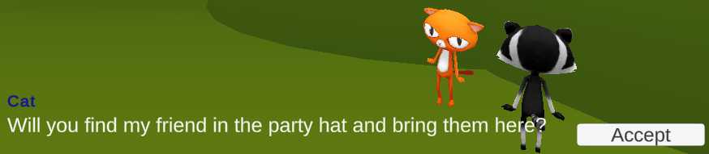
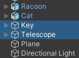
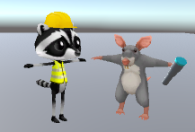

## Deuxième quête

Ajoute un autre PNJ avec une quête et une récompense différentes. Tu peux choisir parmi différents types de quêtes.  

{:width="300px"}

Si les quêtes sont révélées puis accomplies dans un ordre précis, on parle de gameplay **linéaire** ou de storytelling. Si le joueur peut choisir l'ordre dans lequel il accomplit les quêtes, il s'agit alors d'un gameplay **non linéaire**. Certains jeux mélangent un gameplay ou une narration linéaire et non linéaire. Les quêtes qui doivent être accomplies sont appelées **quêtes principales** et les quêtes supplémentaires facultatives sont appelées **quêtes annexes**. 

--- task ---

**Conception :** conçois ta deuxième quête. Les quêtes seront **non linéaires**, elles peuvent donc être commencées dans n'importe quel ordre.

### Type de quête

Ta quête pourrait être :
+ Une quête **récolte** avec plusieurs objets de même nature
+ Une quête **recette** ou **artisanat** avec plusieurs objets de différentes sortes
+ Une quête **escorte** où tu dois trouver un autre PNJ et lui demander de suivre le joueur jusqu'au donneur de quête (ou jusqu'à un autre endroit)
+ Une quête **livraison** où l'on te donne un objet à apporter à un autre PNJ
+ Une quête **histoire** où tu dois trouver et parler à un autre PNJ pour obtenir des informations
+ Une quête **énigme** ou **tâche** où tu dois résoudre une énigme ou accomplir une tâche

### Type de récompense

La récompense peut être donnée par le nouveau donneur de quête ou un autre PNJ et peut être :
+ Points d'expérience (XP), réputation, pièces, gemmes ou autre monnaie du jeu
+ Un accessoire pour le joueur
+ Déverrouillage d'une nouvelle zone ou d'un nouvel objet dans le jeu

Ou une combinaison de ces éléments.

--- /task ---

**La conception de logiciels** consiste à prendre des décisions sur la façon de transformer ton idée en code. Dans Unity, cela signifie décider des GameObjects, des scripts, des variables et des méthodes dont tu auras besoin pour construire ton jeu ou ton histoire interactive. 

### Checklist de quête

Pour ta quête, tu auras besoin de :
+ Ajouter un nouveau PNJ qui sera le donneur de quête avec des objets UI pour communiquer sur la quête
+ Mettre à jour le script ChercheurQuete sur le joueur avec des variables pour stocker l'état de la nouvelle quête
+ Ajouter des objets et d'autres PNJ en fonction du type de quête
+ Ajouter un script au PNJ donneur de quête pour contrôler la conversation et la récompense en fonction de l'état de la quête
+ Ajouter des scripts aux objets et autres PNJ en fonction du type de quête

--- task ---

### Le donneur de quête

Ajoute un nouveau GameObject qui sera le deuxième PNJ Donneur de quête.

**Choisir :**

--- collapse ---

---
title: Dupliquer ton premier PNJ et le modifier
---

Fais un clic droit sur le GameObject **Donneur de quête** que tu as créé pour la première quête et sélectionne **Duplicate**. Cela crée une copie de ton GameObject Donneur de quête avec tous les GameObjects enfants.

Le GameObject Donneur de quête sera créé à la même position, alors utilise la vue Scene ou l'Inspector pour le positionner ailleurs.

Supprime le composant de script QuestGiver existant de l'Inspector en cliquant sur les trois points et en sélectionnant **Remove Component**.

--- /collapse ---

--- collapse ---

---
title: Ajouter un nouveau GameObject PNJ Donneur de quête
---

Choisis un modèle ou crée un nouveau GameObject PNJ Donneur de quête à partir de formes 3D.

Ajoute un **Box Collider** pour que le joueur ne puisse pas passer à travers le nouveau PNJ Donneur de quête et un deuxième **Box Collider**, qui est plus grand que le premier, avec **IsTrigger** coché.

Fais un clic droit sur le **Canvas** de ton premier PNJ et choisis **copy**. Ensuite, fais un clic droit sur ton nouveau **PNJ Donneur de quête** et choisis **Paste as Child**. Cela permet de faire une copie des objets UI pour ton nouveau donneur de quête.

--- /collapse ---

Dans l'Inspector :
+ Modifie le texte du message de ton nouveau canvas de PNJ Donneur de quête pour décrire ta nouvelle quête. Modifie le style du texte pour l'adapter à ton nouveau personnage.
+ Modifie le texte de l'objet Name pour qu'il corresponde à ton nouveau PNJ.

--- collapse ---

---
title: Créer un nouveau script pour le PNJ Donneur de quête
---

Script **DonneurQuete2** :

--- code ---
---
language: csharp
filename: QuestGiver2.cs
line_numbers: false
line_number_start: 
line_highlights: 
---
using TMPro;

public class DonneurQuete2 : MonoBehaviour
{
    public GameObject canvas;
    public GameObject bouton;
    public QuestSeeker joeuer;

    // Start est appelé avant l'update de la première image
    void Start()
    {
        Debug.Log("Début Quest giver 2"); // Update avec le nom de ta quête
        canvas.SetActive(false);
    }
    
    void OnTriggerEnter(Collider other)
    {
        if (other.CompareTag("Joeuer"))
        {
            canvas.SetActive(true);
        }
    }
    
    void OnTriggerExit(Collider other)
    {
        if (other.CompareTag("Joeuer"))
        {
            canvas.SetActive(false);
        }
    }
    
    public void QueteAcceptee()
    {
        Debug.Log("Quest 2 acceptée"); // Update avec le nom de ta quête
    
        canvas.SetActive(false);
        bouton.SetActive(false);
    }
}
--- /code ---

--- /collapse ---

Dans l'Inspector, assure-toi de mettre à jour les objets enfants et les composants de ton nouveau PNJ Donneur de quête, et :
+ Fais glisser les objets **Canvas**, **Message** et **Button** vers ton nouveau script
+ Sélectionne le **Button** et ajoute un **OnClick** défini à la méthode `QueteAcceptee` de ton nouveau script

--- /task ---

--- task ---

**Test :** joue ta scène :
+ Assure-toi de voir le message de la nouvelle quête
+ Vérifie que tu peux accepter la quête à l'aide du bouton
+ Vérifie que tu peux voir le message de débogage dans la console

--- /task ---

--- task ---

### Les objets de quête et/ou les PNJ

Selon le type de quête que tu as choisi, ajoute ou crée les GameObjects que tu utiliseras comme objets à collecter, suiveurs ou récompenses et positionne-les dans ta scène.

Ajoute un composant **Box Collider** à ton GameObject Item qui est plus grand que tous les autres colliders de ton Item et vérifie la propriété Box Collider **IsTrigger**.

**Choisir :** ajoute des effets visuels à tes objets à collecter, tes suiveurs ou tes récompenses.

[[[unity-particle-system]]]

[[[unity-gameobject-spin]]]

Tu pourrais aussi ajouter l'animation **IdleWalk** ou créer un nouvel Animator.

[[[unity-animation]]]

Si ta quête comporte plusieurs éléments qui doivent être désactivés et activés en même temps, alors ajoute le même tag à chacun d'entre eux.

--- collapse ---

---
title: Mettre un tag à tes objets
---

**Créer un nouveau tag :** va dans la propriété Tag en haut de la fenêtre Inspector et **Add Tag**. Clique sur le **+** et ajoute un Tag pour ta quête, par exemple « Quetecle ». Cela te permettra de trouver tous les GameObjects ayant le même Tag afin que tu puisses les activer et les désactiver.

**Appliquer ton nouveau Tag :** sélectionne les GameObjects qui sont des objets de cette quête dans la fenêtre Hierarchy et utilise la liste déroulante Tag pour sélectionner ton nouveau Tag dans la liste.

--- /collapse ---

**Astuce :** si tous tes objets à collecter, tes suiveurs ou tes récompenses auront la même apparence et agiront de la même façon, assure-toi d'ajouter tous tes effets avant de dupliquer le premier GameObject.

--- /task ---

### Contrôler la quête

Configure la quête en utilisant la visibilité initiale, les réactions de déclenchement et le suivi des états de la quête.

--- task ---

### Avant que la quête soit acceptée

Mets en place ta quête en cachant tous les GameObjects qui doivent être cachés jusqu'à ce que la quête soit acceptée.

**Choisir :**

--- collapse ---

---
title: Cacher les objets avec le même tag
---

Script **DonneurQuete2**

--- code ---
---
language: csharp
filename: QuestGiver2.cs
line_numbers: false
line_number_start: 
line_highlights: 
---
GameObject[] collectables;

    // Start est appelé avant l'update de la première image
    void Start()
    {
        canvas.SetActive(false);
    
        collectables = GameObject.FindGameObjectsWithTag("Collectables");
        foreach (var Collectables in collectables)
        {
            Collectables.SetActive(false);
        }
    }
--- /code ---

--- /collapse ---

--- collapse ---

---
title: Cacher les objets individuels
---

Script **DonneurQuete2**

--- code ---
---
language: csharp
filename: QuestGiver2.cs
line_numbers: false
line_number_start: 
line_highlights: 
---

    public GameObject domeGlace;
    
    void Start()
    {
        // Ne pas afficher le message de quête au début
        canvas.SetActive(false);
        domeGlace.SetActive(false);
    }
--- /code ---

Attribue des GameObjects à des variables dans l'éditeur Unity.

--- /collapse ---

--- collapse ---

---
title: Définir la visibilité des objets enfants
---

Script **DonneurQuete2** :

--- code ---
---
language: csharp
filename: QuestGiver2.cs
line_numbers: false
line_number_start: 
line_highlights: 
---
public GameObject telescope; // Objet sur le PNJ
public GameObject joueurTelescope; // Objet sur le joueur
public PlayerController joeuer;

void Start()
{
    telescope.SetActive(true);
    joueurTelescope.SetActive(false);
    canvas.SetActive(false);
}
--- /code ---

--- /collapse ---

--- /task ---

--- task ---

### Lorsque la quête est acceptée

Ajoute une méthode `QueteAcceptee` à ton nouveau PNJ Donneur de quête pour configurer la quête lorsqu'elle a été acceptée. Relie la méthode au bouton « Accepter » de la quête.

**Choisir :**

--- collapse ---

---
title: Faire apparaître un objet individuel
---

Méthode `QueteAcceptee` du script **DonneurQuete2** :

--- code ---
---
language: csharp
filename: QuestGiver2.cs
line_numbers: false
line_number_start: 
line_highlights: 
---

        cle.SetActive(true);
--- /code ---

--- /collapse ---

--- collapse ---

---
title: Faire apparaître plusieurs objets avec le même tag
---

Méthode `QueteAcceptee` du script **DonneurQuete2** :

--- code ---
---
language: csharp
filename: QuestGiver2.cs
line_numbers: false
line_number_start: 
line_highlights: 
---

    foreach (var Collectable in collectables)
    {
        Collectable.SetActive(true);
    }
--- /code ---

--- /collapse ---

--- collapse ---

---
title: Faire apparaître un objet enfant sur le joueur
---

--- code ---
---
language: csharp
filename: QuestGiver2.cs
line_numbers: false
line_number_start: 
line_highlights:
---

    void OnTriggerEnter(Collider other)
    {
        if (other.CompareTag("Joeuer"))
        {
            // Transférer l'objet au joueur pour livraison
            telescope.SetActive(false);
            joeuerTelescope.SetActive(true);
        }
    }
--- /code ---

--- /collapse ---

--- collapse ---

---
title: Mettre à jour une variable pour dire que la quête a été acceptée
---

Script **ChercheurQuete** :

--- code ---
---
language: csharp
filename: QuestSeeker.cs
line_numbers: false
line_number_start: 
line_highlights: 
---
    // Le suiveur ne doit suivre que si la quête a été acceptée
    public bool suivreQueteAcceptee = false;

    void QueteAcceptee()
    {
        suivreQueteAcceptee = true;
    }
--- /code ---

--- /collapse ---

--- /task ---

--- task ---

### Pendant la quête

Mets à jour le script **ChercheurQuete** utilisé par le joueur avec des variables pour garder une trace de l'état de la quête, comme les objets collectés, les objets livrés ou les PNJ qui suivent.

**Choisir :**

--- collapse ---

---
title: Ajouter des variables pour plusieurs objets du même type dans une quête de collecte
---

Dans une quête de collecte, le joueur collecte plusieurs objets du même type.

Script **ChercheurQuete** :

--- code ---
---
language: csharp
filename: QuestSeeker.cs
line_numbers: false
line_number_start: 
line_highlights: 
---
// Ajouter un variable pour stocker la quantité collectée
public int collectables = 0;
--- /code ---

--- /collapse ---

--- collapse ---

---
title: Ajouter des variables pour plusieurs objets différents dans une quête d'artisanat ou de recette
---

Dans une quête de recette ou d'artisanat, le joueur collecte plusieurs objets de différentes sortes pour créer une recette ou fabriquer un nouvel objet.

Script **ChercheurQuete** :

--- code ---
---
language: csharp
filename: QuestSeeker.cs
line_numbers: false
line_number_start: 
line_highlights: 
---
// Ajouter une variable pour chaque objet à collecter
public bool aBlocGlace = false;
public bool aPiolet = false;
--- /code ---

--- /collapse ---

--- collapse ---

---
title: Ajouter des variables pour un suiveur
---

Dans une quête d'escorte, le joueur devra emmener un suiveur avec lui.

Script **ChercheurQuete** :

--- code ---
---
language: csharp
filename: QuestSeeker.cs
line_numbers: false
line_number_start: 
line_highlights: 
---
// Contrôler quand le suiveur suit le joueur
public bool amiSuiveur = false;
--- /code ---

--- /collapse ---

--- /task ---

--- task ---

Ajoute un script à chaque objet de quête ou autre PNJ impliqué dans la quête pour qu'ils réagissent lorsque le joueur entre en collision avec eux.

Tu pourrais aussi vérifier une variable `bool` et ne réagir au joueur que si la quête a été acceptée.

**Choisir :**

--- collapse ---

---
title: Collecter des objets de quête
---

Voici un exemple pour une quête de collection de pièces, chaque pièce aura besoin de ce script.

--- code ---
---
language: csharp
filename: CoinController.cs
line_numbers: false
line_number_start: 
line_highlights: 
---
public class ControleurPiece : MonoBehaviour
{
    public ChercheurQuete player;

    void OnTriggerEnter(Collider other)
    {
        if (other.CompareTag("Joeuer"))
        {
            joeuer.collectables += 1;
            gameObject.SetActive(false);
        }
    }
}
--- /code ---

--- /collapse ---

--- collapse ---

---
title: Collecter des objets de recette ou d'artisanat
---

Voici un exemple pour un IceTool, le même projet a également un GameObject IceBlock collectable avec un script similaire.

--- code ---
---
language: csharp
filename: IceToolController.cs
line_numbers: false
line_number_start: 
line_highlights: 
---
public class ControleurPiolet : MonoBehaviour
{
    public ChercheurQuete player;

    void OnTriggerEnter(Collider other)
    {
        if (other.CompareTag("Joeuer"))
        {
            joeuer.aPiolet = true;
            gameObject.SetActive(false);
        }
    }
}
--- /code ---

--- /collapse ---

--- collapse ---

---
title: Escorter des suiveurs de la quête
---

Voici un exemple pour un suiveur, si le même projet a d'autres GameObjects suiveurs, ils auront également besoin du script.

--- code ---
---
language: csharp
filename: FollowController.cs
line_numbers: false
line_number_start: 
line_highlights: 
---
public class ControleurSuiveur : MonoBehaviour
{
    public ChercheurQuete joeuer;
    float suivreVitesse = 3f;
    float suivreDistance = 1.6f;

    void Update()
    {
        transform.LookAt(player.transform);

        if(player.escortQueteAcceptee == true && Vector3.Distance(player.transform.position, transform.position) > suivreDistance)
        {
                CharacterController controller = GetComponent<CharacterController>();
                var moveDirection = Vector3.Normalize(player.transform.position - transform.position);
                controller.SimpleMove(moveDirection * suivreVitesse);
        }
    }
    
    void OnTriggerEnter(Collider other)
    {
        if (other.CompareTag("Joeuer"))
        {
            joeuer.amiSuiveur = true;
        }
    }
}
--- /code ---

--- /collapse ---

--- collapse ---

---
title: Faire transférer ou disparaître un objet enfant
---

Sur le script pour le PNJ qui recevra l'objet :

--- code ---
---
language: csharp
filename: QuestGiver.cs
line_numbers: false
line_number_start: 
line_highlights: 
---
void OnTriggerEnter(Collider other)
    {
        if (other.CompareTag("Joeuer"))
        {
            telescope.SetActive(true);
            joeuerTelescope.SetActive(false);
        }
    }
--- /code ---

--- /collapse ---

--- collapse ---

---
title: Ne réagit que si le joueur a accepté la quête
---

Script **FollowerNPC** :

--- code ---
---
language: csharp
filename: FollowNPC.xs
line_numbers: false
line_number_start: 
line_highlights: 
---

    void Update()
    {
        if(joeuer.escortQueteAcceptee)
        {
            // Suivre le joueur
        }
    }
--- /code ---

--- /collapse ---

--- /task ---

### Fin de quête

Définis la réaction du donneur de quête à l'issue de la quête, applique les récompenses et fais en sorte que la quête ne puisse pas être proposée à nouveau.

--- task ---

Le PNJ donneur de quête doit vérifier que la quête est terminée et remercier le joueur.

--- collapse ---

---
title: Vérifier si le joueur dispose d'une quantité suffisante du même objet
---

--- code ---
---
language: csharp
filename: QuestGiver.cs
line_numbers: false
line_number_start: 
line_highlights: 
---

    if (player.pieces >= 3) // Si toutes les pièces ont été collectées
    {
        message.SetText("Bravo, tu as collecté les pièces !");
    
    }
--- /code ---

--- /collapse ---

--- collapse ---

---
title: Vérifier si le joueur possède plusieurs objets différents
---

--- code ---
---
language: csharp
filename: QuestGiver.cs
line_numbers: false
line_number_start: 
line_highlights: 
---

    if (joeuer.aBlocGlace && joeuer.aPiolet)
    {
        // CPasser à un message d'achèvement réussi
        message.SetText("Merci de m'avoir aidé à terminer mon dôme de glace. Tu peux y grimper si tu le souhaites.");
    }
--- /code ---

--- /collapse ---

**Astuce :** tu peux utiliser le Booléen AND `&&` et le Booléen OR `||` pour combiner des vérifications de conditions.

--- /task ---

--- task ---

**Choisir :** Que se passe-t-il lorsque ton joueur accomplit une quête ?

--- collapse ---

---
title: Monnaie ou expérience
---

Tu peux utiliser des pièces de monnaie ou une autre monnaie pour ton jeu. Tu peux aussi récompenser le joueur avec des XP (points d'expérience).

Garde une trace des récompenses en monnaie ou en points en utilisant une variable dans le script ChercheurQuete et demande aux scripts QuestGiver de la mettre à jour lorsqu'une quête est terminée.

--- code ---
---
language: csharp
filename: QuestSeeker.cs
line_numbers: false
line_number_start: 
line_highlights: 
---
public int gemmes; // Garder une trace des gemmes
--- /code ---

--- code ---
---
language: csharp
filename: QuestSeeker.cs
line_numbers: false
line_number_start: 
line_highlights: 
---
player.gemmes += 2; // Donner une récompense au joueur
--- /code ---

--- /collapse ---

--- collapse ---

---
title: Un accessoire ou un suiveur
---

Tu pourrais utiliser `SetActive` pour permettre à un objet enfant d'afficher un accessoire tel qu'un chapeau. Tu devras créer une variable publique sur le PNJ Donneur de quête pour stocker l'objet enfant et le faire glisser vers l'Inspector.

--- code ---
---
language: csharp
filename: QuestGiver.cs
line_numbers: false
line_number_start: 
line_highlights: 
---
public GameObject chapeau;
--- /code ---

Utilise ensuite `SetActive` lorsque la quête a été accomplie.

--- code ---
---
language: csharp
filename: QuestGiver.cs
line_numbers: false
line_number_start: 
line_highlights: 
---
chapeau.SetActive(true)
--- /code ---

Tu peux aussi faire en sorte qu'un personnage PNJ devienne un suiveur ou un animal de compagnie en changeant la variable qu'il vérifie pour décider s'il doit suivre le joueur.

--- code ---
---
language: csharp
filename: QuestGiver.cs
line_numbers: false
line_number_start: 
line_highlights: 
---
joeuer.chienSuiveur = true;
--- /code ---

--- /collapse ---

--- collapse ---

---
title: Déblocage
---

Un type de récompense pourrait être la suppression d'un obstacle ou l'accès à une zone ou à des articles qui n'étaient pas disponibles auparavant.

Réfléchis aux GameObjects que tu veux supprimer. Créée et applique-leur une nouveau tag « Déblocage ».

Ouvre ton script QuestGiver et crée une variable pour stocker les GameObjects à débloquer :

--- code ---
---
language: csharp
filename: QuestGiver.cs
line_numbers: false
line_number_start: 
line_highlights: 
---
    public GameObject[] debloquer;
--- /code ---

Ajoute du code à la méthode `Start()` pour activer les objets au départ.

--- code ---
---
language: csharp
filename: QuestGiver.cs
line_numbers: false
line_number_start: 
line_highlights: 
---
        debloquer = GameObject.FindGameObjectsWithTag("Débloquer");

        foreach (var Debloquer in debloquer)
        {
            Debloquer.SetActive(true);
        }
--- /code ---

Crée un script de déblocage et attache-le à un nouvel allié de quête PNJ ou à un nouvel objet de déblocage.

--- code ---
---
language: csharp
filename: Unlock.cs
line_numbers: false
line_number_start: 
line_highlights: 
---
public class Debloquer : MonoBehaviour
{
    public GameObject canvas;
    public AudioClip collectSound;
    public DonneurQuete debloquer;

    // Start est appelé avant l'update de la première image
    void Start()
    {      
        canvas.SetActive(false);
    }
    
    void OnTriggerEnter(Collider other)
    {
        if (other.CompareTag("Joeuer"))
        {        
            canvas.SetActive(true);
            AudioSource.PlayClipAtPoint(collectSound, transform.position);
    
            foreach (var Debloquer in debloquer.debloquer)
            {
                Debloquer.SetActive(false);
            }
        }
    }
    
    void OnTriggerExit(Collider other)
    {
        if (other.CompareTag("Joeuer"))
        {
            canvas.SetActive(false);
        }
    }
}
--- /code ---

Tu pourrais aussi introduire un nouvel ennemi de quête PNJ ou un nouvel objet de blocage pour remplacer les barrières.

--- /collapse ---

--- /task ---

--- task ---

Le deuxième PNJ Donneur de quête doit vérifier si le joueur a terminé la quête, puis lui donner la récompense.

--- /task ---

--- task ---

Assure-toi que la récompense ne peut pas être donnée plus d'une fois.

--- collapse ---

---
title: Supprimer des objets du joueur
---

--- code ---
---
language: csharp
filename: QuestGiver.cs
line_numbers: false
line_number_start: 
line_highlights: 
---

    // S'assurer que la récompense ne peut pas être donnée à nouveau
    joeuer.aBlocGlace = false;
    joeuer.aPiolet = false;
--- /code ---

--- /collapse ---

--- collapse ---

---
title: Réinitialiser les variables de quête
---
--- code ---
---
language: csharp
filename: QuestGiver.cs
line_numbers: false
line_number_start: 
line_highlights: 
---

    joeuer.escortQueteAcceptee = false;
--- /code ---

--- /collapse ---

--- /task ---

### Déboguer ta quête

--- task ---

**Debogage :** il se peut que tu trouves des bogues dans ton projet que tu dois corriger.

Vérifie toujours dans la console si tes scripts contiennent des erreurs. Unity donne des messages d'erreur utiles pour de nombreux problèmes courants et tu peux souvent cliquer sur le message d'erreur pour aller directement au problème.

--- collapse ---

---
title: Mon nouveau donneur de quête affiche le mauvais message
---

Sélectionne le donneur de quête et trouve son composant de script. Assure-toi que les bons GameObjects (ceux de cette quête qui sont des objets enfants du donneur de quête) sont utilisés. Si tu cliques sur un GameObject attaché dans l'Inspector, cet objet sera mis en évidence dans Hierarchy.

Vérifie que tu as bien changé :
+ Le texte de la quête dans le message GameObject TextMeshPro
+ Le texte de fin de quête dans la méthode `OnTriggerEnter` qui est défini lorsque la quête est terminée

Si le donneur de quête n'affiche pas le message de fin de quête alors que tu penses que la quête est terminée, alors vérifie bien ton code. Mets-tu correctement à jour l'état de la quête dans le script QuestSeeker et vérifies-tu correctement l'état de la quête dans le script QuestGiver pour ce donneur de quête ?

Ajoute des déclarations `Debug.Log()` et vérifie que les valeurs changent dans l'Inspector en mode Play comme prévu.

--- /collapse ---

--- collapse ---

---
title: Rien ne se passe quand je clique sur le bouton Accepter
---

Sélectionne ton PNJ Donneur de quête et assure-toi qu'il a un script qui a une méthode `AccepterQuete`.

Vérifie que toutes les variables sont définies sur le script dans l'Inspector.

Clique sur l'objet **Button** et vérifie que tu as attaché la bonne méthode telle que `AccepterQuete` à un événement **OnClick**.

Ajoute une ligne `Debug.Log("Quête acceptée");` à la méthode et vérifie dans la Console que la méthode est bien appelée.

Si tu es sûr que la méthode est appelée, vérifie que le code de la méthode est correct.

Si la méthode n'est pas appelée (pas de sortie Debug), alors vérifie que tu as un GameObject `EventSystem` dans ton projet. Si tu le supprimes accidentellement, les clics sur les boutons ne seront pas pris en compte. S'il est manquant, fais un clic droit dans Hierarchy et choisis **UI** puis **Event System**.

--- /collapse ---

--- collapse ---

---
title: Mon collectable ne disparaît pas
---

Vérifie que le collectable possède un script avec une méthode `OnTriggerEnter` qui désactive le collectable si le joueur entre en collision avec lui.

Assure-toi d'avoir ajouté un Box Collider avec un Trigger et que le collider est plus grand que tous les colliders sans trigger afin que le joueur puisse le déclencher.

Vérifie que le GameObject Joueur possède le tag Joueur.

--- /collapse ---

--- collapse ---

---
title: Mon suiveur ne suit pas
---

Vérifie que tu as ajouté un composant Character Controller et un script pour contrôler le mouvement du suiveur.

Si tu utilises une variable publique pour le joueur, vérifie que tu l'as bien assignée dans l'Inspector.

Vérifie que les conditions pour suivre le joueur sont vraies. Utilise les instructions `Debug.Log()` et vérifie les variables dans l'Inspector.

Assure-toi que le suiveur détecte la collision avec le joueur. Assure-toi que le suiveur a un Box Collider avec un Trigger et que ce collider est plus grand que les autres.

--- /collapse ---

[[[unity-physics-colliders]]]

[[[unity-animation]]]

--- /task ---

--- save ---
