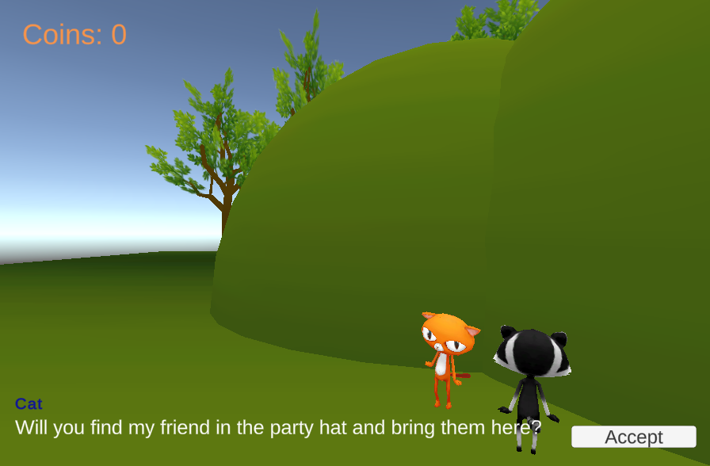

## Wat ga je maken

In dit project voeg je NPC's en quests (zoektochten) toe aan de wereld die je hebt gemaakt in het project [Bouw je eigen wereld](https://projects.raspberrypi.org/nl-NL/projects/world-builder){:target='_blank'}.

Dit project wordt je aangeboden met steun van [Unity Technologies](https://unity.com/){:target="_blank"}.  Deze [projecten](https://projects.raspberrypi.org/nl-NL/pathways/unity-intro){:target="_blank"} bieden jongeren de kans om hun eerste stappen te zetten in het maken van virtuele werelden met gebruik van Real-Time 3D.

Een **quest**, ook wel zoektocht genoemd, is een taak of missie in een computerspel die de speler kan voltooien om een beloning te krijgen of het verhaal vooruit te helpen. Voorbeelden van quests kunnen zijn dat een speler een item ophaalt of aflevert, items verzamelt, een personage naar een locatie begeleidt, informatie opzoekt of een puzzel oplost. Na voltooiing kan een speler worden beloond met ervaringen, munten, toegang tot nieuwe gebieden of nieuwe vaardigheden.

Je gaat:
+ Een NPC toevoegen met een dialoog die verandert op basis van de spelstatus
+ De status van een quest beheren met behulp van een of meer variabelen
+ De speler en NPC's vaardigheden geven om een of meer quests te voltooien (verzamelen, begeleiden, afleveren)

--- no-print ---

### Afspelen ▶️

--- task ---

Speel de quests in het voorbeeldproject. Denk na over het soort quest en de uitkomst.
+ Wat is de beloning voor het voltooien van de quest?
+ Hoe communiceren de NPC's met de speler?
+ Hoe worden voorwerpen gebruikt in de quest?

[Snow quest](https://raspberrypilearning.github.io/unity-webgl/SnowQuest){:target='_blank'}

<iframe allowtransparency="true" width="710" height="450" src="https://raspberrypilearning.github.io/unity-webgl/SnowQuest" frameborder="0"></iframe>

{:width="400px"}

--- /task ---

### Doe inspiratie op 💭

Je gaat een aantal ontwerpbeslissingen nemen om je spelletje te creëren.

--- task ---

Bekijk deze voorbeeldprojecten om meer ideeën op te doen:

Maze quest:[Probeer het](https://raspberrypilearning.github.io/unity-webgl/maze-quest-seeker){:target='_blank'} 
{:width="400px"}e

Hill quest:[Probeer het](https://raspberrypilearning.github.io/unity-webgl/HillQuest){:target='_blank'} 
{:width="400px"}

Om te ontdekken hoe deze projecten tot stand zijn gekomen, download en unzip de [Unity packages](https://rpf.io/p/nl-NL/quest-seeker-get){:target='_blank'} en importeer ze dan één voor één in een nieuw 3D Unity project.

[[[unity-create-3d-project]]]

[[[unity-importing-a-package]]]

--- /task ---

--- /no-print ---

--- print-only ---

### Doe inspiratie op

Je gaat een aantal ontwerpbeslissingen nemen om je spelletje te creëren.

Gebruik deze voorbeeld afbeeldingen om meer ideeën te krijgen:

Snow Quest: https://raspberrypilearning.github.io/unity-webgl/SnowQuest
{:width="400px"}

Maze quest: https://raspberrypilearning.github.io/unity-webgl/maze-quest-seeker
{:width="400px"}

Hill quest: https://raspberrypilearning.github.io/unity-webgl/HillQuest
{:width="400px"}

--- /print-only ---

