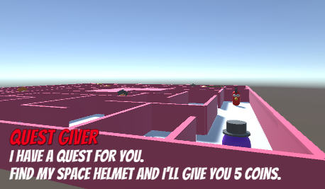
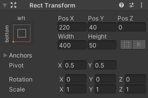
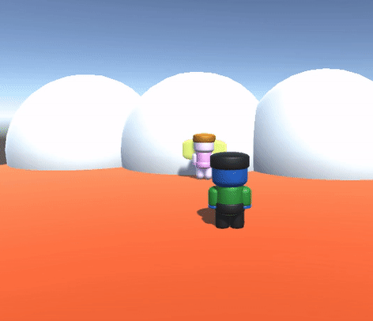
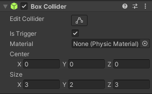
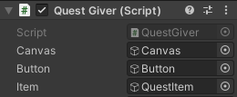

## Eerste quest

De eerste quest zal een **zoek quest** zijn waar een niet-speler personage (NPC) de speler vraagt om een voorwerp te vinden en het naar hem terug te brengen. 

Wanneer de speler terugkeert naar de opdrachtgever, wordt hij beloond met ervaringspunten (XP) of een beloning in de valuta van je spel.

{:width="300px"}

--- task ---

Dit project bouwt voort op het project dat je hebt gemaakt in het project [Bouw je eigen wereld](https://projects.raspberrypi.org/nl-NL/projects/world-builder){:target='_blank'}.

Open je project om het te gebruiken als de wereld of kaart, waar de opdrachten plaatsvinden.

--- /task ---

Een **Game Designer** creëert de personages, regels, doelen, spelmechanismen en puzzels die een spel leuk en boeiend maken voor de speler. Sommige gameontwerpers maken alle code voor hun game zelf, anderen werken in teams.

--- task ---

**Ontwerp:** Bedenk een quest die past in de wereld die je hebt gebouwd.

Je zult moeten beslissen over:
+ Een item dat moet worden opgehaald
+ Een niet-speler karakter (NPC) om de opdracht te geven aan de speler
+ De berichten voor de NPC om weer te geven voor en nadat de quest voltooid is
+ Een beloning van ervaringspunten of valuta (munten of edelstenen) in je spel

--- /task ---

--- task ---

Voeg een GameObject toe voor het voorwerp dat de speler moet halen.

Plaats het item zo in je wereld zodat de speler vanaf zijn beginpositie niet direct kan zien en moet bewegen om het te vinden.

**Kies:**

[[[unity-item-model]]]

[[[unity-item-3d-shapes]]]

--- /task ---

--- task ---

Voeg een NPC toe als opdrachtgever en positioneer deze zo dat de speler deze gemakkelijk kan vinden.

**Kies:**

[[[unity-npc-model]]]

[[[unity-npc-3d-shapes]]]

--- /task ---

--- taak ---
Als je de Cat, Rat of Raccoon kiest, dan kun je **Animator Controller** instellen op de **IdleWalk** animatie.

--- /task ---

--- task ---

Voeg een **Box Collider** toe aan de **Opdrachtgever** zodat de speler er niet doorheen kan lopen.

--- /task ---

De Opdrachtgever zal de speler een quest aanbieden als hij dichtbij genoeg komt.

--- Zorg ervoor dat het Player GameObject de Player-tag heeft.
--- /task ---

--- task ---

Voeg een UI **TextMeshPro** met de naam `Quest Text` toe als **onderliggend object van de Opdrachtgever** en voeg je bericht met de opdracht eraan toe.

--- collapse ---

---
title: TextMeshPro-tekst toevoegen en positioneren
---

Wijzig de tekst van het bericht, instellingen en de positie van het tekstobject totdat je tevreden bent:

 

Je kunt nog een UI **TextMeshPro** toevoegen aan hetzelfde canvas met de naam van de opdrachtgever NPC als je wilt.

--- /collapse ---

[[[unity-ui-positioning-2d]]]

--- /task ---

--- task ---

Voeg een **Box Collider** toe met een **Trigger** en een **Opdrachtgever** script aan de Opdrachtgever NPC om het bericht te laten verschijnen wanneer de speler in de buurt is.

{:width="400px"}

--- collapse ---

---
title: Laat een bericht verschijnen als de speler dichtbij genoeg is
---

Voeg nog een **Box Collider** toe met de Trigger-eigenschap is aangevinkt. Deze Box Collider moet groter zijn dan de eerste Box Collider, zodat de speler de Opdrachtgever kan activeren om een tekstvak weer te geven.

Voeg een script toe met de naam **Opdrachtgever** aan het **Opdrachtgever GameObject**. Voeg `OnTriggerEnter` en `OnTriggerExit` methoden toe om het berichtencanvas te tonen en te verbergen wanneer de speler dichtbij komt en weggaat.

Voeg code toe aan een script op het NPC GameObject.

--- code ---
---
language: csharp
filename: QuestGiver.cs
line_numbers: false
line_number_start: 5
line_highlights: 7-23, 27
---

public class Opdrachtgever : MonoBehaviour
{
    public GameObject canvas;

    void OnTriggerEnter(Collider other)
    {
        if (other.CompareTag("Speler"))
        {
            canvas.SetActive(true);
        }
    }
    
    void OnTriggerExit(Collider other)
    {
        if (other.CompareTag("Speler"))
        {
            canvas.SetActive(false);
        }
    }
    // Start wordt aangeroepen vóór de eerste frame-update
    void Start()
    {
        canvas.SetActive(false);
    }
}
--- /code ---

Selecteer het **Opdrachtgever GameObject**. In de Inspector, zoek de **Opdrachtgever** script component en sleep het **Canvas** voor de NPC naar de Canvas eigenschap van het script.

--- /collapse ---

--- /task ---

--- task ---

**Test:** Speel je scène af:
+ Controleer of de speler niet door de Opdrachtgever kan lopen
+ Zorg ervoor dat het bericht verschijnt wanneer de speler in de buurt van de opdrachtgever is

**Fouten oplossen:**

[[[unity-collider-error]]]

[[[unity-trigger-error]]]

--- /task ---

Voor deze quest mag het te verzamelen item pas verschijnen als de quest is geaccepteerd.

--- task ---

Voeg een **Accepteer knop** toe aan het Canvas op je Oprachtgever NPC en verbind deze met een `OpdrachtGeaccepteerd` methode op je **OpdrachtGever** script. Update het script **Opdrachtgever** zodat het item alleen wordt weergegeven wanneer de quest is geaccepteerd.

{:width="400px"}

--- collapse ---

---
title: Laat een Item GameObject verschijnen wanneer op een knop wordt geklikt
---

Voeg een UI **TextMesh Pro-knop** toe aan hetzelfde canvas en klik op het **Text (TMP)** onderliggend object van de knop en geef het vervolgens de tekst `Accepteren`:

Pas de grootte van de knop en de tekstgrootte, positie en kleuren aan totdat je er blij mee bent:

Voeg code toe aan het Opdrachtgever script om te regelen wanneer het object verschijnt, zodat het alleen verschijnt wanneer de quest is geaccepteerd.

--- code ---
---
language: csharp
filename: QuestGiver.cs
line_numbers: false
line_number_start: 6
line_highlights: 9, 10, 30, 39
---
public class Opdrachtgever : MonoBehaviour
{
    public GameObject canvas;
    public GameObject knop;
    public GameObject item;

    void OnTriggerEnter(Collider other)
    {
        if (other.CompareTag("Speler"))
        {
            canvas.SetActive(true);
        }
    }
    
    void OnTriggerExit(Collider other)
    {
        if (other.CompareTag("Speler"))
        {
            canvas.SetActive(false);
        }
    }
    
    public void OpdrachtGeaccepteerd()
    {
        item.SetActive(true); // Laat het quest tem verschijnen
        canvas.SetActive(false); // Verberg het bericht wanneer de quest is geaccepteerd
        knop.SetActive(false); // Laat de knop niet zien nadat de quest is geaccepteerd
    }
    
    // Start wordt aangeroepen vóór de eerste frame-update
    void Start()
    {
        canvas.SetActive(false);
        item.SetActive(false);
    }
--- /code ---

Selecteer de **Opdrachtgever**, sleep dan in de **Opdrachtgever** script component in het Inspector venster, je **Knop** en **Item GameObjects** naar de knop en voorwerp eigenschappen:

Selecteer in het Hierarchy venster de **knop GameObject** ga vervolgens in het Inspector venster naar de `On Click ()` eigenschap en klik op de **+**.

Klik op de cirkel voor het veld onder 'Runtime', klik op **Scène** en kies je **Opdrachtgever**. Selecteer in het Functie drop-down menu **Opdrachtgever.OpdrachtGeaccepteerd** om jouw nieuwe methode toe te voegen aan de klikgebeurtenis van de knop:

--- /collapse ---

**Tip:** Als je een Canvas als onderliggend object hebt, dan kan je je niet focussen op het bovenliggende GameObject in de scèneweergave. Om dit te verhelpen, kun je het Canvas in de Inspector uitzetten door het vinkje naast de naam uit te schakelen. Als je het Canvas opnieuw wilt zien om het te bewerken, vink dan het vakje aan.

--- /task ---

--- task ---

**Test:** Speel je scène af:
+ Controleer of je item niet wordt weergegeven aan het begin
+ Ga naar en communiceer met de Opdrachtgever en accepteer de quest
+ Zorg ervoor dat het item verschijnt wanneer de quest wordt geaccepteerd
+ Controleer ook of de 'Accepteren' knop verdwijnt en niet opnieuw wordt weergegeven als je terugkeert naar de Opdrachtgever

**Fouten oplossen:**

--- collapse ---

---
title: Er gebeurt niets als ik op de knop Accepteren klik
---

Selecteer je **Opdrachtgever NPC** en zorg ervoor dat deze een script heeft dat een `OpdrachtGeaccepteerd` methode heeft.

Controleer of alle variabelen zijn ingesteld op het script in de Inspector.

Klik op het **Knop** object en controleer of je de juiste methode, zoals `OpdrachtGeaccepteerd` aan een `OnClick` -evenement hebt gekoppeld.

Voeg een `Debug.Log("Opdracht geaccepteerd");` regel toe aan de methode en controleer de console om te zien dat de methode wordt aangeroepen.

Als je zeker weet dat de methode wordt aangeroepen, controleer dan of de code in de methode juist is.

Als de methode niet wordt aangeroepn (geen Debug output), zorg er dan voor dat je een `EventSystem` GameObject in je project hebt. Als je dit per ongeluk verwijdert, worden klikken op de knop niet behandeld. Als het ontbreekt, klik dan met de rechtermuisknop in het Hierarchy venster en kies **UI** dan **Event System**.

--- /collapse ---

--- /task ---

Wanneer de speler het item verzamelt, moet het item verdwijnen en eventueel een geluidseffect afspelen. De Opdrachtgever zal ook moeten weten wanneer de quest is voltooid.

--- task ---

Voeg een UI **TextMeshPro** toe aan de scène om de beloning te tonen. Voeg een **OpdrachtZoeker** script toe aan de speler om de beloning op te slaan en bij te werken.

--- collapse ---

---
title: Voeg een OpdrachtZoeker script toe aan de speler om de beloning op te slaan en bij te werken
---

Rechtsklik in het Hierarchy venster en voeg een UI **TextMeshPro** toe aan je scène om de beloning te tonen. Noem het nieuwe object `Munt Tekst`, of een geschikte naam voor je beloning.

Voeg een nieuwe **OpdrachtZoeker** script component toe aan de Player om de beloning te tonen.

De `munten` variabele moet `public` zijn, zodat een script op het Opdracht Item het kan bijwerken.

--- code ---
---
language: csharp
filename: QuestSeeker.cs
line_numbers: false
line_number_start: 4
line_highlights: 4, 8, 9, 20
---
using TMPro;

public class OpdrachtZoeker : MonoBehaviour
{
    public int munten = 0; // Of de beloning voor je zoektocht
    public TMP_Text muntTekst;

    // Start wordt aangeroepen vóór de eerste frame-update
    void Start()
    {
        
    }

    // Update wordt één keer per frame aangeroepen
    void Update()
    {
       muntTekst.SetText("Munten: " + munten); 
    }
}
--- /code ---

--- /collapse ---

Met het Player object geselecteerd, sleep het **Munt Tekst TextMeshPro** object naar de MuntTekst eigenschap in de Inspector.

--- /task ---

--- task ---

Voeg een `public bool heeftOpdrachtItem = false;` variabele toe aan het **OpdrachtZoeker** script. De variabele moet `public` zijn zodat een script op het item op `waar` zet wanneer het item wordt verzameld.

--- collapse ---

---
title: Voeg een heeftOpdrachtItem variabele toe aan de OpdrachtZoeker script
---

--- code ---
---
language: csharp
filename: QuestSeeker.cs
line_numbers: false
line_number_start: 4
line_highlights: 8
---
using TMPro;

public class OpdrachtZoeker : MonoBehaviour
{
    public bool heeftOpdrachtItem = false; 
    public int munten = 0; 
    public TMP_Text muntTekst;

    // Update wordt één keer per frame aangeroepen
    void Update()
    {
       muntTekst.SetText("Munten: " + munten); 
    }
}
--- /code ---

--- /collapse ---

--- /task ---

--- task ---

Voeg een **Box Collider** toe met een **Trigger** en **OpdrachtItemController** script aan je Opdracht Item. Voeg code toe om het Opdracht Item te verbergen en zet `heeftOpdrachtItem` op waar op het OpdrachtZoeker script van de speler als de Speler botst met het Opdracht Item.

{:width="400px"}

--- collapse ---

---
title: Laat het item verdwijnen en stel heeftOpdrachtItem in op waar
---

Selecteer het **Opdracht Item** en voeg een **Box Collider** toe met een **Trigger**.

Voeg een **-script** toe aan het **Opdracht Item** en noem het `OpdrachtItemController`.

Voeg code toe om het item te verbergen en werk de `heeftOpdrachtItem` status bij op de Player.

--- code ---
---
language: csharp
filename: QuestItemController.cs
line_numbers: false
line_number_start: 5
line_highlights: 9-16
---
public class OpdrachtItemController : MonoBehaviour
{
    public OpdrachtZoeker player;

    private void OnTriggerEnter(Collider other)
    {
        if (other.CompareTag("Speler"))
        {
            player.heeftOpdrachtItem = true;
            gameObject.SetActive(false);
        }
    }
--- /code ---

Sleep het **Player GameObject** naar de Player eigenschap van het OpdrachtItemController script in de Inspector voor het Opdracht Item.

--- /collapse ---

Speel optioneel ook een geluid af als het item wordt verzameld.

[[[unity-play-sound]]]

--- /task ---

--- task ---

**Test:** Speel je scène af:
+ Ga naar en communiceer met de Opdrachtgever en accepteer de quest
+ Controleer of je het Opdracht Item kunt verzamelen
+ Terwijl je nog steeds in de Play mode bent, klik op de Player en controleer of de `heeftOpdrachtItem` eigenschap in het Inspector venster is aangevinkt om te laten zien dat het quest item is verzameld

--- collapse ---

---
title: Mijn Opdracht Item verdwijnt niet
---

Controleer of het Opdracht Item een script heeft met een `OnTriggerEnter` methode die het Opdracht Item deactiveert als de Player ermee botst.

Zorg ervoor dat je een Box Collider met een Trigger hebt toegevoegd en dat de collider groter is dan een niet-trigger collider, zodat de speler het kan activeren.

Zorg ervoor dat het Player GameObject de Player-tag heeft.

--- /collapse ---

--- /task ---

--- task ---

Laat de Opdrachtgever NPC een ander bericht weergeven als de opdracht voltooid is en geef de speler een beloning voor het voltooien van de opdracht.

{:width="400px"}

--- collapse ---

---
title: Update het Opdrachtgever script om de speler te bedanken en te belonen
---
--- code ---
---
language: csharp
filename: QuestGiver.cs
line_numbers: false
line_number_start: 1
line_highlights: 4, 11, 12, 18-23
---
using System.Collections;
using System.Collections.Generic;
using UnityEngine;
using TMPro;

public class Opdrachtgever : MonoBehaviour
{
    public GameObject canvas;
    public GameObject knop;
    public GameObject item;
    public TMP_Text bericht;
    public OpdrachtZoeker speler;

    void OnTriggerEnter(Collider other)
    {
        if (other.CompareTag("Speler"))
        {
            if (player.heeftOpdrachtItem)
            {
                bericht.SetText("Bedankt voor het vinden van mijn visgraat. Hier zijn 10 munten voor je inspanningen!");
                speler.munten += 10;
                speler.heeftOpdrachtItem = false;
            }    
            canvas.SetActive(true);
        }
    }
--- /code ---

In de Inspector sleep de **Speler** naar de spelereigenschap en het object **TextMeshPro** met het bericht naar de eigenschap van het bericht.

--- /collapse ---

--- /task ---

--- task ---

**Test:** Speel je scène af:
+ Zorg ervoor dat je een ander bericht ontvangt na het verzamelen van het Opdracht Item
+ Controleer of het aantal munten ook toeneemt
+ Zorg ervoor dat de speler de beloning niet meer dan één keer kan ontvangen

--- /task ---

--- task ---

**Fouten oplossen:** Mogelijk vind je enkele fouten in jouw project die je moet oplossen. Hier zijn enkele veelvoorkomende fouten.

[[[unity-console-error]]]

[[[unity-changes-gone]]]

[[[unity-method-absent]]]

[[[unity-show-variables]]]

--- collapse ---

---
title: Ik kan een GameObject niet in mijn variabele slepen in de Inspector
---

Bekijk de bovenstaande stappen en zorg ervoor dat je alle scripts hebt toegevoegd aan de juiste GameObjects.

Controleer of de variabele `public` is.

--- /collapse ---

--- /task ---

--- save ---
