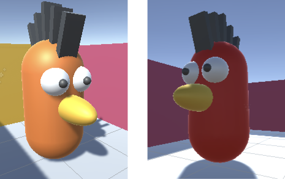
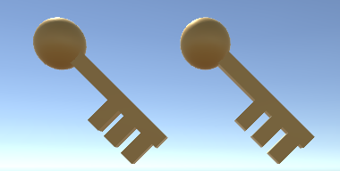

## Tweede quest

Voeg nog een NPC toe met een andere quest en beloning. Je kunt uit verschillende soorten opdrachten kiezen.  

{:width="300px"}

Als quests worden onthuld en vervolgens in een bepaalde reeks worden voltooid, heet dit **lineair** gameplay of storytelling. Als de speler de volgorde kan kiezen waarin hij de quests uitvoert, dan is dit **niet-lineair** gameplay. Sommige games mixen lineair en niet-lineair gameplay of storytelling. Opdrachten die moeten worden voltooid worden **main quests** genoemd en optionele opdrachten worden **side quests** genoemd. 

--- task ---

**Ontwerp:** Ontwerp je tweede quest. De opdrachten zullen **niet-lineair** zijn zodat ze in elke volgorde kunnen worden gestart.

### Opdracht type

Je quest zou kunnen zijn:
+ Een **verzamel** quest met meerdere voorwerpen van hetzelfde type
+ Een **recept** of **bouw** opdracht met meerdere items van verschillende soorten
+ Een **begeleid** quest waar je een andere NPC moet vinden en deze de speler terug laat volgen naar de Opdrachtgever (of naar een andere locatie)
+ Een **bezorg** quest waar je een object krijgt om naar een andere NPC te brengen
+ Een **story** quest waar je een andere NPC moet vinden en met andere NPC moet communiceren om meer informatie te krijgen
+ Een **puzzel** of **taak** quest waar je een puzzel moet oplossen of een taak moet voltooien

### Soort beloning

De beloning kan gegeven worden door de nieuwe Opdrachtgever of een andere NPC en kan zijn:
+ Ervaringspunten (XP), reputatie, munten, edelstenen of een andere in-game valuta
+ Een accessoire voor de speler
+ Een nieuw gebied of item in het spel ontgrendelen

Of een combinatie hiervan.

--- /task ---

**Softwareontwerp** is het nemen van beslissingen over hoe je jouw idee in code omzet. In Unity betekent dit dat je moet beslissen over de GameObjects, scripts, variabelen en methoden die je nodig hebt om je game of interactieve verhaal te bouwen. 

### Opdracht-checklist

Voor elk niveau, moet je:
+ Een nieuwe NPC toevoegen als Opdrachtgever met UI-objecten om over de opdracht te communiceren
+ Het OpdrachtZoeker-script op de speler bijwerken met variabelen om de status van de nieuwe quest op te slaan
+ Items en andere NPC's toevoegen, afhankelijk van het type quest
+ Een script toevoegen aan de Opdrachtgever NPC om het gesprek te besturen en te belonen op basis van de status van de quest
+ Scripts toevoegen aan Items en andere NPC's afhankelijk van het type quest

--- task ---

### De Opdrachtgever

Voeg een nieuw GameObject toe om de tweede Opdrachtgever NPC aan te maken.

**Kies:**

--- collapse ---

---
title: Dupliceer je eerste NPC en verander het
---

Klik met de rechtermuisknop op het **Opdrachtgever GameObject** dat je hebt gemaakt voor de eerste opdracht en selecteer **Duplicate**. Dit maakt een kopie van je Opdrachtgever GameObject inclusief alle onderliggende GameObjects.

Het Opdrachtgever GameObject zal worden aangemaakt op dezelfde positie, dus gebruik de Scèneweergave of Inspector om het ergens anders te plaatsen.

Verwijder de bestaande Opdrachtgever-scriptcomponent uit de Inspector door op de drie stippen te klikken en **Remove Component** te selecteren.

--- /collapse ---

--- collapse ---

---
title: Voeg een nieuw Opdrachtgever NPC GameObject toe
---

Kies een model of maak een nieuw Opdrachtgever NPC GameObject uit 3D-vormen.

Voeg een **Box Collider** toe zodat de speler niet door de nieuwe Opdrachtgever NPC kan lopen en een tweede **Box Collider**, die groter is dan de eerste, waarbij **IsTrigger** wordt aangevinkt.

Klik met de rechtermuisknop op de **Canvas** voor je eerste NPC en kies **copy**. Klik met de rechtermuisknop op je **Opdrachtgever NPC** en kies **Paste as Child**. Dit maakt een kopie van de UI objecten van je nieuwe Opdrachtgever.

--- /collapse ---

In de inspector:
+ Bewerk de tekst in het bericht op je nieuwe Opdrachtgever NPC Canvas om je nieuwe opdracht te beschrijven. Gebruik een tekststijl die past bij je nieuwe personage.
+ Bewerk de tekst in het Name object zodat deze overeenkomt met je nieuwe NPC.

--- collapse ---

---
title: Maak een nieuw script voor de Opdrachtgever NPC
---

**Opdrachtgever2** -script:

--- code ---
---
language: csharp
filename: QuestGiver2.cs
line_numbers: false
line_number_start: 
line_highlights: 
---
using TMPro;

public class Opdrachtgever2 : MonoBehaviour
{
    public GameObject canvas;
    public GameObject knop;
    public OpdrachtZoeker speler;

    // Start wordt aangeroepen vóór de eerste frame-update
    void Start()
    {
        Debug.Log("Opdrachtgever 2 start"); // Update met de naam van je quest
        canvas.SetActive(false);
    }

    void OnTriggerEnter(Collider other)
    {
        if (other.CompareTag("Speler"))
        {
            canvas.SetActive(true);
        }
    }

    void OnTriggerExit(Collider other)
    {
        if (other.CompareTag("Speler"))
        {
            canvas.SetActive(false);
        }
    }

    public void OpdrachtGeaccepteerd()
    {
        Debug.Log("Opdracht 2 geaccepteerd"); // Update met de naam van je quest

        canvas.SetActive(false);
        knop.SetActive(false);
    }
}
--- /code ---

--- /collapse ---

Zorg ervoor dat je in de Inspector de onderliggende objecten en componenten voor je nieuwe Opdrachtgever NPC bijwerkt, en:
+ Sleep de **Canvas**, **Message** en **Button** objecten naar je nieuwe script
+ Selecteer de **Button** en voeg een **onClik** toe die is ingesteld op de `OpdrachtGeaccepteerd` methode van je nieuwe script

--- /task ---

--- task ---

**Test:** Speel je scène af:
+ Zorg ervoor dat je het nieuwe opdracht bericht ziet
+ Controleer of je de quest kunt accepteren met de knop
+ Controleer of je het debug bericht in de Console kunt zien

--- /task ---

--- task ---

### De quest items en/of NPC's

Afhankelijk van het type quest dat je hebt gekozen, maak je GameObjects of voeg ze toe, die je als prijzen, volgers, of beloningen gaat gebruiken en plaats ze in je scène.

Voeg een **Box Collider** component toe aan je Item GameObject die groter is dan alle andere colliders op je Item en controleer de eigenschap **IsTrigger** van de Box Collider.

**Kies:** Voeg visuele effecten toe aan je verzamelobjecten, volgers of beloningen.

[[[unity-particle-system]]]

[[[unity-gameobject-spin]]]

Je kunt ook de **IdleWalk** animatie toevoegen of een nieuwe Animator maken.

[[[unity-animation]]]

Als je quest meerdere items heeft die moeten worden gedeactiveerd en tegelijkertijd geactiveerd voeg dan dezelfde tag toe aan elk van hen.

--- collapse ---

---
title: Label je items
---

**Maak een nieuwe tag aan:** Ga naar de Tag eigenschap bovenaan het Inspector venster en kiest **Add Tag**. Klik op de **+** en voeg een tag toe voor jouw quest, bijvoorbeeld 'SleutelOpdracht'. Hierdoor kun je alle GameObjects met dezelfde tag vinden, zodat je ze kunt activeren en deactiveren.

**Pas je nieuwe tag toe:** Selecteer de GameObjects die items zijn in deze quest in het Hierarchy-venster en gebruik de Tag keuzelijst om je nieuwe tag uit de lijst te selecteren.

--- /collapse ---

**Tip:** Als al je verzamelobjecten, volgers of beloningen er hetzelfde uitzien en zich hetzelfde gedragen, zorg er dan voor dat je al je effecten toevoegt voordat je het eerste GameObject dupliceert.

--- /task ---

### De quest besturen

Stel de quest op met de initiële zichtbaarheid, trigger reacties en het volgen van de quest statussen.

--- task ---

### Voordat de quest wordt geaccepteerd

Stel je quest in door alle spelobjecten te verbergen die verborgen moeten worden totdat de quest is geaccepteerd.

**Kies:**

--- collapse ---

---
title: Verberg items met dezelfde tag
---

**Opdrachtgever2**-script

--- code ---
---
language: csharp
filename: QuestGiver2.cs
line_numbers: false
line_number_start: 
line_highlights: 
---
GameObject[] verzamelobjecten;

    // SStart wordt aangeroepen vóór de eerste frame-update
    void Start()
    {
        canvas.SetActive(false);

        verzamelobjecten = GameObject.FindGameObjectsWithTag("Verzamelobjecten");
        foreach (var Verzamelobjecten in verzamelobjecten)
        {
            Verzamelobjecten.SetActive(false);
        }
    }
--- /code ---

--- /collapse ---

--- collapse ---

---
title: Afzonderlijke items verbergen
---

**Opdrachtgever2**-script

--- code ---
---
language: csharp
filename: QuestGiver2.cs
line_numbers: false
line_number_start: 
line_highlights: 
---
    public GameObject iglo;

    void Start()
    {
        // Laat het quest bericht niet aan het begin zien
        canvas.SetActive(false);
        iglo.SetActive(false);
    }
--- /code ---

GameObjects toewijzen aan variabelen in de Unity Editor.

--- /collapse ---

--- collapse ---

---
title: Stel zichtbaarheid in voor onderliggende items
---

**Opdrachtgever2**-script:

--- code ---
---
language: csharp
filename: QuestGiver2.cs
line_numbers: false
line_number_start: 
line_highlights: 
---
public GameObject telescoop; // Item op NPC
public GameObject spelerTelescoop; // Item op speler
public PlayerController speler;

void Start()
{
    telescoop.SetActive(true);
    spelerTelescoop.SetActive(false);
    canvas.SetActive(false);
}
--- /code ---

--- /collapse ---

--- /task ---

--- task ---

### Wanneer de quest geaccepteerd wordt

Voeg een `OpdrachtGeaccepteerd` methode toe aan je nieuwe Opdrachtgever NPC om de quest in te stellen zetten wanneer deze geaccepteerd is. Verbind de methode met de knop 'Accepteren' voor de quest.

**Kies:**

--- collapse ---

---
title: laat een afzonderlijk item verschijnen
---

`OpdrachtGeaccepteerd` methode van **Opdrachtgever2** script:

--- code ---
---
language: csharp
filename: QuestGiver2.cs
line_numbers: false
line_number_start: 
line_highlights: 
---
        sleutel.SetActive(true);
--- /code ---

--- /collapse ---

--- collapse ---

---
title: Laat meerdere items met dezelfde tag verschijnen
---

`OpdrachtGeaccepteerd` methode van **Opdrachtgever2** script:

--- code ---
---
language: csharp
filename: QuestGiver2.cs
line_numbers: false
line_number_start: 
line_highlights: 
---
    foreach (var Verzamelobject in verzamelobjecten)
    {
        Verzamelobject.SetActive(true);
    }
--- /code ---

--- /collapse ---

--- collapse ---

---
title: Laat een onderliggend item op de Speler verschijnen
---

--- code ---
---
language: csharp
filename: QuestGiver2.cs
line_numbers: false
line_number_start: 
line_highlights: 
---
    void OnTriggerEnter(Collider other)
    {
        if (other.CompareTag("Speler"))
        {
            // Verplaats item naar de speler voor levering
            telescoop.SetActive(false);
            spelerTelescoop.SetActive(true);
        }
    }
--- /code ---

--- /collapse ---

--- collapse ---

---
title: Update een variabele om aan te geven dat de quest is geaccepteerd
---

**Opdrachtgever**-script:

--- code ---
---
language: csharp
filename: QuestSeeker.cs
line_numbers: false
line_number_start: 
line_highlights: 
---
    // De volger mag alleen volgen als de quest is geaccepteerd
    public bool volgQuestGeaccepteerd = false;

    void OpdrachtGeaccepteerd()
    {
        volgQuestGeaccepteerd = true;
    }
--- /code ---

--- /collapse ---

--- /task ---

--- task ---

### Tijdens de quest

Update het **OpdrachtZoeker**-script dat door de speler wordt gebruikt met variabelen om de status van de quest bij te houden, zoals verzamelde items, afgeleverde items of het aantal volgende NPC's.

**Kies:**

--- collapse ---

---
title: Voeg variabelen toe voor meerdere items van hetzelfde type in een verzamel quest
---

Bij een verzamel quest verzamelt de speler meerdere items van dezelfde soort.

**Opdrachtgever**-script:

--- code ---
---
language: csharp
filename: QuestSeeker.cs
line_numbers: false
line_number_start: 
line_highlights: 
---
// Voeg een variabele toe om het verzamelde bedrag op te slaan
public int verzamelobjecten = 0;
--- /code ---

--- /collapse ---

--- collapse ---

---
title: Voeg variabelen toe voor meerdere verschillende items in een bouw- of recepten quest
---

Bij een recepten- of bouwquest verzamelt de speler meerdere items van verschillende soorten om een recept te maken of een nieuw item te maken.

**Opdrachtgever**-script:

--- code ---
---
language: csharp
filename: QuestSeeker.cs
line_numbers: false
line_number_start: 
line_highlights: 
---
// Voeg een variabele toe voor elk item dat moet worden verzameld
public bool heeftIjsBlok = false;
public bool heeftIjsGereedschap = false;
--- /code ---

--- /collapse ---

--- collapse ---

---
title: Voeg variabelen toe voor een volger
---

In een begeleid quest zal de speler een volger mee moeten nemen.

**Opdrachtgever**-script:

--- code ---
---
language: csharp
filename: QuestSeeker.cs
line_numbers: false
line_number_start: 
line_highlights: 
---
// Om te bepalen wanneer de volger de speler volgt
public bool vriendVolger = false;
--- /code ---

--- /collapse ---

--- /task ---

--- task ---

Voeg een script toe aan elk quest item of andere NPC die bij de quest betrokken is, zodat ze reageren wanneer de speler ermee in botsing komt.

Je kunt ook een variabele `bool` aanvinken en alleen op de Speler reageren als de quest is geaccepteerd.

**Kies:**

--- collapse ---

---
title: Verzamel quest items
---

Hier is een voorbeeld voor een munten verzamelen quest, waarbij elke munt dit script nodig heeft.

--- code ---
---
language: csharp
filename: CoinController.cs
line_numbers: false
line_number_start: 
line_highlights: 
---
public class MuntController : MonoBehaviour
{
    public OpdrachtZoeker speler;

    void OnTriggerEnter(Collider other)
    {
        if (other.CompareTag("Speler"))
        {
            speler.verzamelobjecten += 1;
            gameObject.SetActive(false);
        }
    }
}
--- /code ---

--- /collapse ---

--- collapse ---

---
title: Verzamel ingrediënten of maak een item quest
---

Hier is een voorbeeld voor een IJsGereedschap, hetzelfde project heeft ook een IJsblok-verzamelbaar GameObject met een soortgelijk script.

--- code ---
---
language: csharp
filename: IceToolController.cs
line_numbers: false
line_number_start: 
line_highlights: 
---
public class IjsGereedschapController : MonoBehaviour
{
    public OpdrachtZoeker speler;

    void OnTriggerEnter(Collider other)
    {
        if (other.CompareTag("Speler"))
        {
            speler.heeftIjsGereedschap = true;
            gameObject.SetActive(false);
        }
    }
}
--- /code ---

--- /collapse ---

--- collapse ---

---
title: Begeleid quest volgers
---

Hier is een voorbeeld voor een volger. Als hetzelfde project andere GameObjects van volgers heeft, hebben zij het script ook nodig.

--- code ---
---
language: csharp
filename: FollowController.cs
line_numbers: false
line_number_start: 
line_highlights: 
---
public class VolgerController : MonoBehaviour
{
    public OpdrachtZoeker speler;
    float volgSnelheid = 3f;
    float volgAfstand = 1.6f;

    void Update()
    {
        transform.LookAt(speler.transform);

        if(speler.begeleidOpdrachtGeaccepteerd == true && Vector3.Distance(speler.transform.position, transform.position) > volgAfstand)
        {
                CharacterController controller = GetComponent<CharacterController>();
                var moveDirection = Vector3.Normalize(speler.transform.position - transform.position);
                controller.SimpleMove(moveDirection * volgSnelheid);
        }
    }

    void OnTriggerEnter(Collider other)
    {
        if (other.CompareTag("Speler"))
        {
            speler.vriendVolger = true;
        }
    }
}
--- /code ---

--- /collapse ---

--- collapse ---

---
title: Laat een onderliggend item overbrengen of verdwijnen
---

In het script voor de NPC om het item te ontvangen:

--- code ---
---
language: csharp
filename: QuestGiver.cs
line_numbers: false
line_number_start: 
line_highlights: 
---
void OnTriggerEnter(Collider other)
    {
        if (other.CompareTag("Speler"))
        {
            telescoop.SetActive(true);
            spelerTelescoop.SetActive(false);
        }
    }
--- /code ---

--- /collapse ---

--- collapse ---

---
title: Reageer alleen als de speler de quest heeft geaccepteerd
---

**VolgerNPC**-script:

--- code ---
---
language: csharp
filename: FollowNPC.xs
line_numbers: false
line_number_start: 
line_highlights: 
---
    void Update()
    {
        if(speler.begeleidOpdrachtGeaccepteerd)
        {
            // Volg Speler
        }
    }
--- /code ---

--- /collapse ---

--- /task ---

### Quest voltooid

Zorg voor de reactie van de Opdrachtgever na voltooiing van de quest, pas beloningen toe en zorg ervoor dat de quest niet opnieuw kan worden aangeboden.

--- task ---

De Opdrachtgever NPC moet controleren of de quest is voltooid en de speler bedanken.

--- collapse ---

---
title: Controleer of de Speler genoeg van hetzelfde item verzameld heeft
---

--- code ---
---
language: csharp
filename: QuestGiver.cs
line_numbers: false
line_number_start: 
line_highlights: 
---
    if (speler.munten >= 3) // Als alle munten zijn verzameld
    {
        bericht.SetText("Goed gedaan, je hebt de munten verzameld!");
              
    }
--- /code ---

--- /collapse ---

--- collapse ---

---
title: Controleer of de Speler meerdere verschillende items heeft verzameld
---

--- code ---
---
language: csharp
filename: QuestGiver.cs
line_numbers: false
line_number_start: 
line_highlights: 
---
    if (speler.heeftIjsBlok && speler.heeftIjsGereedschap)
    {
        // Verander in een succesvol voltooiingsbericht
        bericht.SetText("Bedankt dat je me hebt geholpen mijn iglo af te maken. Je kunt hem beklimmen als je wilt.");
    }
--- /code ---

--- /collapse ---

**Tip:** Je kunt Boolean AND `&&` en Boolean OF `||` gebruiken om voorwaardelijke controles te combineren.

--- /task ---

--- task ---

**Kies:** Wat gebeurt er als je speler een quest voltooid?

--- collapse ---

---
title: Valuta of ervaring
---

Je kunt munten of een andere valuta gebruiken voor je spel. Of je kunt de speler belonen met XP (ervaringspunten).

Houd valuta of punten beloningen bij met een variabele in het OpdrachtZoeker script en laat de Opdrachtgever scripts updaten wanneer een quest is voltooid.

--- code ---
---
language: csharp
filename: QuestSeeker.cs
line_numbers: false
line_number_start: 
line_highlights: 
---
public int edelstenen; // Houd de edelstenen bij
--- /code ---

--- code ---
---
language: csharp
filename: QuestSeeker.cs
line_numbers: false
line_number_start: 
line_highlights: 
---
speler.edelstenen += 2; // Geef een beloning aan de speler
--- /code ---

--- /collapse ---

--- collapse ---

---
title: Een accessoire of volger
---

Je kunt `SetActive` gebruiken om via een onderliggend item een accessoire te laten zien zoals een hoed. Je moet een public variabele maken op de Opdrachtgever NPC om het onderliggende item op te slaan en naar de Inspector te slepen.

--- code ---
---
language: csharp
filename: QuestGiver.cs
line_numbers: false
line_number_start: 
line_highlights: 
---
public GameObject hoed;
--- /code ---

Then use `SetActive` when the quest has been completed. 

--- code ---
---
language: csharp
filename: QuestGiver.cs
line_numbers: false
line_number_start: 
line_highlights: 
---
hoed.SetActive(true)
--- /code ---

Je kunt een NPC-personage ook een volger of een huisdier laten worden door de variabele te wijzigen die ze controleren om te beslissen of ze de speler willen volgen.

--- code ---
---
language: csharp
filename: QuestGiver.cs
line_numbers: false
line_number_start: 
line_highlights: 
---
speler.hondVolgt = true;
--- /code ---

--- /collapse ---

--- collapse ---

---
title: Ontgrendelen
---

Een soort beloning kan zijn het verwijderen van een barrière of het verkrijgen van toegang tot een gebied of items die voorheen niet beschikbaar waren.

Denk na over de GameObjects die je wilt verwijderen. Maak een nieuwe 'Unlock'-tag en pas deze toe.

Open je Opdrachtgever-script en maak een variabele om de Ontgrendel GameObjecten op te slaan:

--- code ---
---
language: csharp
filename: QuestGiver.cs
line_numbers: false
line_number_start: 
line_highlights: 
---
    public GameObject[] ontgrendel;
--- /code ---

Voeg code toe aan de `Start()` methode om de items aan het begin in te schakelen.

--- code ---
---
language: csharp
filename: QuestGiver.cs
line_numbers: false
line_number_start: 
line_highlights: 
---
        ontgrendel = GameObject.FindGameObjectsWithTag("Ontgrendel");

        foreach (var Ontgrendel in ontgrendel)
        {
            Ontgrendel.SetActive(true);
        }
--- /code ---

Maak een ontgrendelingsscript en koppel dit aan een nieuwe NPC-quest bondgenoot of aan een nieuw ontgrendelingsitem.

--- code ---
---
language: csharp
filename: Unlock.cs
line_numbers: false
line_number_start: 
line_highlights: 
---
public class Ontgrendel : MonoBehaviour
{
    public GameObject canvas;
    public AudioClip collectSound;
    public Opdrachtgever ontgrendel;

    // Start wordt aangeroepen vóór de eerste frame-update
    void Start()
    {      
        canvas.SetActive(false);
    }

    void OnTriggerEnter(Collider other)
    {
        if (other.CompareTag("Speler"))
        {        
            canvas.SetActive(true);
            AudioSource.PlayClipAtPoint(collectSound, transform.position);

            foreach (var Ontgrendel in ontgrendel.ontgrendel)
            {
                Ontgrendel.SetActive(false);
            }
        }
    }

    void OnTriggerExit(Collider other)
    {
        if (other.CompareTag("Speler"))
        {
            canvas.SetActive(false);
        }
    }
}
--- /code ---

Je kunt ook een nieuwe NPC-quest vijand of een nieuw slotitem introduceren om de barrières te vervangen.

--- /collapse ---

--- /task ---

--- task ---

De tweede Opdrachtgever NPC moet controleren of de speler de quest heeft voltooid en hem vervolgens de beloning geven.

--- /task ---

--- task ---

Zorg ervoor dat de beloning niet vaker dan één keer kan worden gegeven.

--- collapse ---

---
title: Items van de speler verwijderen
---

--- code ---
---
language: csharp
filename: QuestGiver.cs
line_numbers: false
line_number_start: 
line_highlights: 
---
    // Zorg ervoor dat de beloning niet vaker dan één keer kan worden gegeven
    speler.heeftIjsBlok = false;
    speler.heeftIjsGereedschap = false;
--- /code ---

--- /collapse ---

--- collapse ---

---
title: Quest variabelen opnieuw instellen
---
--- code ---
---
language: csharp
filename: QuestGiver.cs
line_numbers: false
line_number_start: 
line_highlights: 
---
    speler.begeleidOpdrachtGeaccepteerd = false;
--- /code ---

--- /collapse ---

--- /task ---

### Los fouten op in je quest

--- task ---

**Fouten oplossen:** Mogelijk vind je enkele fouten in jouw project die je moet oplossen.

Controleer altijd de console op fouten in jouw scripts. Unity geeft nuttige foutmeldingen voor veel voorkomende problemen en je kunt vaak op de foutmelding klikken om rechtstreeks naar het probleem te gaan.

--- collapse ---

---
title: Mijn nieuwe Opdrachtgever geeft de verkeerde boodschap weer
---

Selecteer de Opdrachtgever en zoek de scriptcomponent ervan. Zorg ervoor dat de juiste GameObjects (degene voor deze zoektocht die onderliggende objecten zijn van de Opdrachtgever) worden gebruikt. Als je op een bijgevoegd GameObject in de Inspector klikt, wordt dat object gemarkeerd in de Hierarchy.

Controleer of je het volgende hebt gewijzigd:
+ De opdracht tekst in het MessageTextMeshPro GameObject
+ De tekst voor het voltooien van de quest in de `OnTriggerEnter` -methode die wordt ingesteld wanneer de quest is voltooid

Als de Opdrachtgever het quest voltooid bericht niet laat zien wanneer je denkt dat de quewst is voltooid, controleer dan je code zorgvuldig. Heb je QuestZoeker status in het QuestZoeker script correct bijgewerkt en correct gecontroleerd in het Opdrachtgever script van deze Opdrachtgever?

Voeg `Debug.Log()` opdrachten toe en controleer of de waarden veranderen in de Inspector tijdens de Speelmodus wanneer je dat verwacht.

--- /collapse ---

--- collapse ---

---
title: Er gebeurt niets als ik op de knop Accepteren klik
---

Selecteer je Opdrachtgever NPC en zorg ervoor dat er een script is met een `AccepteerQuest` methode.

Controleer of alle variabelen zijn ingesteld op het script in de Inspector.

Klik op het **Button** object en controleer of je de juiste methode, zoals `OpdrachtGeaccepteerd` aan een **OnClick** -evenement hebt gekoppeld.

Voeg een `Debug.Log("Opdracht geaccepteerd");` regel toe aan de methode en controleer de console om te zien dat de methode wordt aangeroepen.

Als je zeker weet dat de methode wordt aangeroepen, controleer dan of de code in de methode juist is.

Als de methode niet wordt aangeroepen (geen Debug output), zorg er dan voor dat je een `EventSystem` GameObject in je project hebt. Als je dit per ongeluk verwijdert, worden klikken op de knop niet behandeld. Als het ontbreekt, klik dan met de rechtermuisknop in het Hierarchy venster en kies **UI** dan **Event System**.

--- /collapse ---

--- collapse ---

---
title: Mijn Quest Item verdwijnt niet
---

Controleer of het verzamelobject een script heeft met een `OnTriggerEnter` methode die het verzamelobject deactiveert als de Speler ermee botst.

Zorg ervoor dat je een Box Collider met een Trigger hebt toegevoegd en dat de collider groter is dan een niet-trigger collider, zodat de speler het kan activeren.

Zorg ervoor dat het Player GameObject de Player-tag heeft.

--- /collapse ---

--- collapse ---

---
title: Mijn volger volgt niet
---

Controleer of je een Character Controller-component en een script hebt toegevoegd om de beweging van de volger te besturen.

Zorg ervoor dat het script toegang heeft tot de Speler. Als je een public variabele voor de Speler gebruikt, controleer dan of je deze in de Inspector hebt toegewezen.

Controleer of de voorwaarden om de speler te volgen waar zijn. Gebruik `Debug.Log()` instructies en controleer variabelen in de Inspector.

Zorg ervoor dat de volger de botsing met de speler detecteert. Zorg ervoor dat de volger een Box Collider met een Trigger heeft en dat deze collider groter is dan andere colliders.

--- /collapse ---

[[[unity-physics-colliders]]]

[[[unity-animation]]]

--- /task ---

--- save ---
